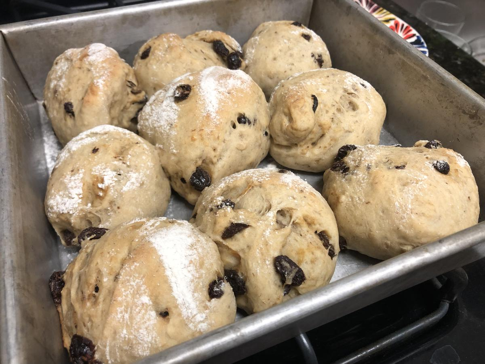

# Banana Rolls

> Based on [https://www.youtube.com/watch?v=c5db7MWYFro](https://www.youtube.com/watch?v=c5db7MWYFro)

<!-- {cts} rating=3; (User can specify rating on scale of 1-5) -->

Personal rating: :fontawesome-solid-star: :fontawesome-solid-star: :fontawesome-solid-star: :fontawesome-solid-star: :fontawesome-solid-star: :fontawesome-solid-star: :fontawesome-regular-star: :fontawesome-regular-star:

<!-- {cte} -->

<!-- {cts} name_image=banana_rolls.jpeg; (User can specify image name) -->

{: .image-recipe loading=lazy }

<!-- {cte} -->

## Ingredients

* [ ] 2 Ripe Bananas
* [ ] 1 Egg
* [ ] 3g Active Yeast
* [ ] 28g butter (soften, microwave if needed)
* [ ] 80g Raisins or chocolate chips
* [ ] 3g Salt
* [ ] 350g Flour

## Recipe

* Proof
    * Mix bananas with a fork
    * Combine the egg, yeast, butter, raisins, salt, and flour in steps
    * Cover and rise for 1.5 hours until double in size
* Bake
    * Lightly grease an 8x8 pan
    * Sprinkle flour on a cutting board, then fold and pat flat
        * Slice into a 3x3 grid, then pinch/fold and roll to be round
    * Place into 8x8 pan for 45 min until risen
    * To top, sprinkle flour over a fork on each
    * Bake at 375 for 15-20 min

## Notes

* In general, raisins can be soaked in rum, vanilla and spices like clove, ginger and cinnamon or just soaked in water
