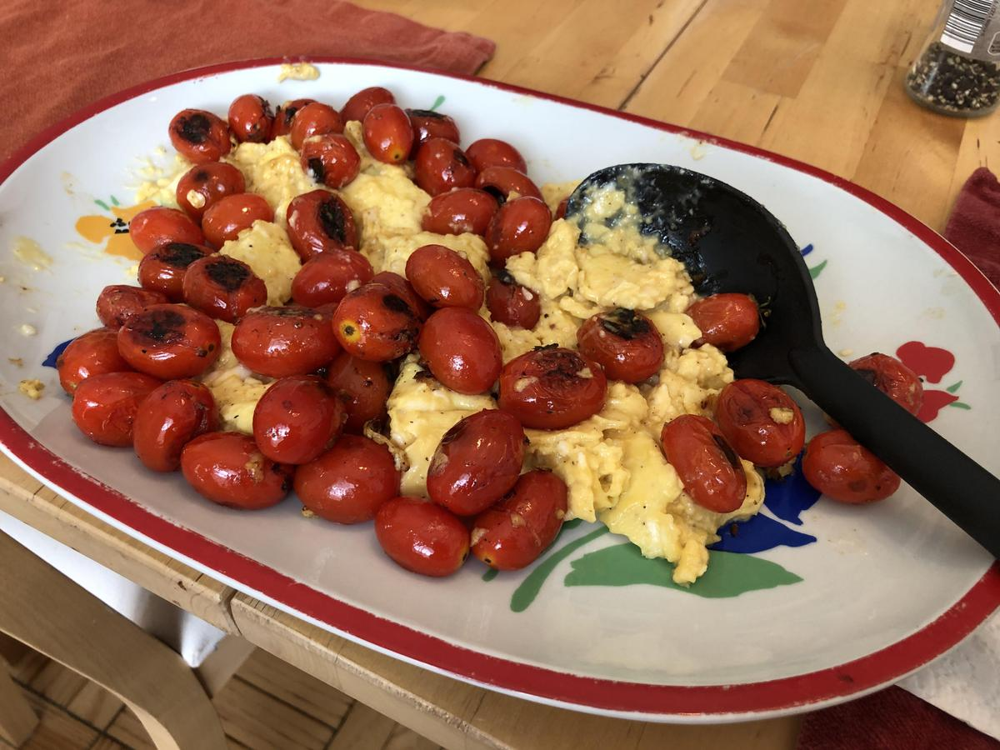

# Cheesy Cheeseless Scrambled Eggs With Burst Cherry Tomatoes

> Based on [Chrissy Teigen Cravings], pg. 16

<!-- {cts} rating=3; (User can specify rating on scale of 1-5) -->

Personal rating: :fontawesome-solid-star: :fontawesome-solid-star: :fontawesome-solid-star: :fontawesome-regular-star: :fontawesome-regular-star:

<!-- {cte} -->

<!-- {cts} name_image=cheesy_cheeseless_scrambled_eggs_with_burst_cherry_tomatoes.jpeg; (User can specify image name) -->

{: .image-recipe loading=lazy }

<!-- {cte} -->

## Ingredients

### Eggs

- [ ] 12 eggs
- [ ] 1/2 cup heavy cream
- [ ] 1 tsp salt
- [ ] 1/4 tsp pepper
- [ ] 3 tbsp olive oil
- [ ] 3 tbsp butter

### Tomatoes

- [ ] 2 tbsp olive oil
- [ ] 3 cups cherry tomatoes (~1 lb)
- [ ] 1/2 tsp salt
- [ ] 1/4 tsp pepper
- [ ] (opt) 1/4 cup thinly sliced chives
- [ ] (opt) garlic-roasted bacon

## Recipe

- Whisk eggs, heavy cream, salt, and pepper until combined
- In large nonstick skillet, heat oil and butter over LOW heat until butter is melted
- Start heating a cast iron skillet on medium heat until hot
- Add eggs and cook, stirring until a custardly and forming small curds. (12-14 min). Remove from heat
- Make the tomatoes in parallel during the last 10 min of the egg cook time. In the hot skillet, add oil, swirl, then add the tomatoes. Sprinkle with salt and pepper. Cook for 5-6 min until tomatoes shrivel
- Serve with the optional chives/bacon on top

## Notes

- For every 4 eggs, 2.5 tbsp cream, 1 tbsp butter, 1 tbsp olive oil

[chrissy teigen cravings]: https://www.penguinrandomhouse.com/books/252973/cravings-by-chrissy-teigen-with-adeena-sussman/
