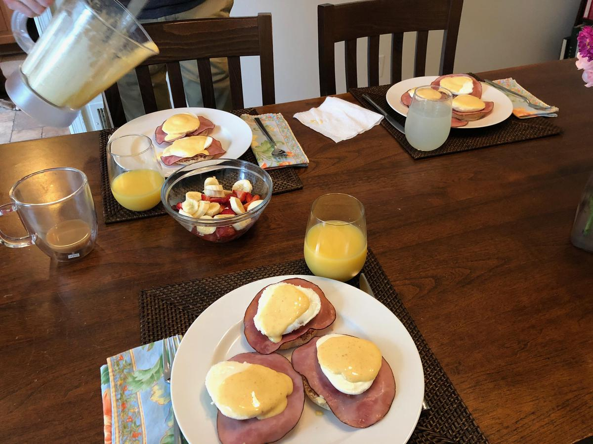

<!-- Needs Manual Review -->

<!-- Do not modify sections with "AUTO-*". They are updated by make.py -->

# Eggs Benedict

> Based on [https://cooking.nytimes.com/recipes/1018626-eggs-benedict](https://cooking.nytimes.com/recipes/1018626-eggs-benedict)

<!-- rating=3; (User can specify rating on scale of 1-5) -->
<!-- AUTO-UserRating -->
Personal rating: :fontawesome-solid-star: :fontawesome-solid-star: :fontawesome-solid-star: :fontawesome-solid-star: :fontawesome-solid-star: :fontawesome-solid-star: :fontawesome-regular-star: :fontawesome-regular-star:
<!-- /AUTO-UserRating -->

<!-- name_image=eggs_benedict.jpg; (User can specify image name) -->
<!-- AUTO-Image -->
{: .image-recipe loading=lazy }
<!-- /AUTO-Image -->

## Ingredients

* [ ] FOR THE BENEDICT AND ASSEMBLY
    * [ ] 4 english muffins, split
    * [ ] 8 slices Canadian bacon or thick-cut ham
    * [ ] 2 tbsp unsalted butter
    * [ ] 1/4 cup chopped chives
    * [ ] 2 tbsp parsley
    * [ ] flaky sea salt
    * [ ] pepper
* [ ] FOR THE HOLLANDAISE
    * [ ] 1/2 cup (1 stick) unsalted butter
    * [ ] 3 large egg yolks
    * [ ] 2 tsp fresh lemon juice (1/4 lemon)
    * [ ] 1/4 teaspoon cayenne or hot paprika
    * [ ] salt, kosher
    * [ ] pepper
* [ ] FOR THE POACHED EGGS
    * [ ] 1 tbsp white distilled vinegar
    * [ ] salt, kosher
    * [ ] 8 large eggs
    * [ ] egg poaching cups, metal or silicone

## Recipe

* Melt butter, pour in glass juicer, prep lemon and cayenne in cup then check blender speed. Let cool slightly if using a plastic blender
* Cut up fruit for side dish and prep table
* Make the hollandaise:
* > Melt butter in a small pot over medium heat until it’s foamy but not yet beginning to brown, 3 to 4 minutes
* > Place egg yolks and 2-3 tsp water in a blender. Start blending and very slowly add the hot, melted butter until incorporated then add the lemon juice, cayenne, salt, and pepper
* > Transfer the hollandaise to a small bowl, and place plastic wrap directly on the surface so it doesn’t form a skin. Set aside at room temperature.
* In parallel
* > Cook Canadian bacon or ham (or bacon) in a medium skillet over medium–high heat until golden brown and just crisp at the edges, about 6 minutes.
* > Poach the eggs: Fill a lidded pan with water up to the edge of the egg poaching cups and begin heating. Once boiling, poach the eggs for ~6 minutes or until slightly firm, but still runny. Will need to do two batches of four.
* > Throughly toast the English muffins until crisp and golden brown--they will need to be sturdy
* Assemble the Benedict: Butter the eight halves of English muffin on a plate and butter them generously. Top each with a slice of selected meat, poached egg, then spoon hollandaise sauce. Sprinkle with chives, parsley, flaky sea salt, and black pepper.

## Notes

* The tricky part of this recipe is to get everything hot and served at the same time.
