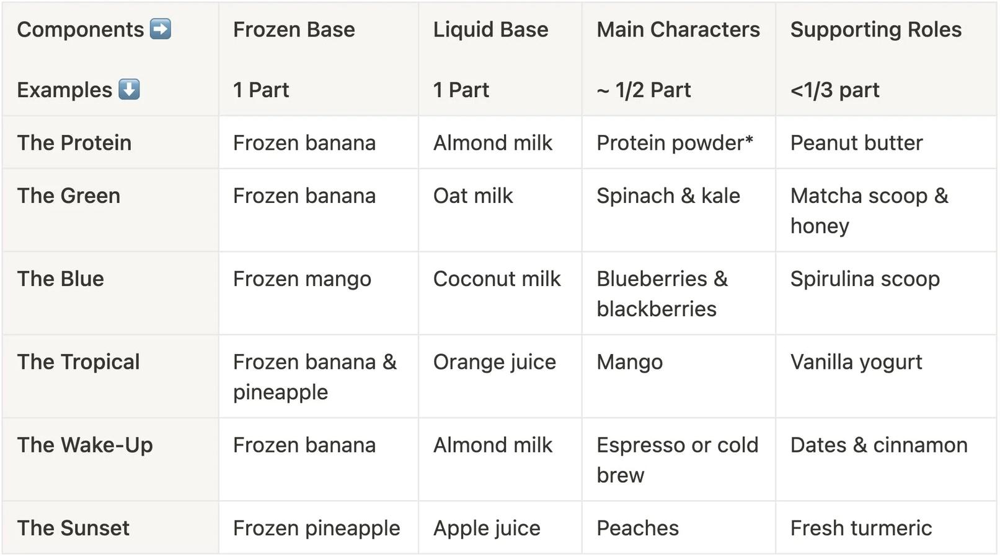

# Smoothies

> Based on [https://newsletter.ethanchlebowski.com/posts/why-do-homemade-smoothies-suck](https://newsletter.ethanchlebowski.com/posts/why-do-homemade-smoothies-suck)

<!-- {cts} rating=4; (User can specify rating on scale of 1-5) -->

Personal rating: :fontawesome-solid-star: :fontawesome-solid-star: :fontawesome-solid-star: :fontawesome-solid-star: :fontawesome-solid-star: :fontawesome-solid-star: :fontawesome-solid-star: :fontawesome-regular-star:

<!-- {cte} -->

<!-- {cts} name_image=smoothies-table.jpg; (User can specify image name) -->

{: .image-recipe loading=lazy }

<!-- {cte} -->

## Ingredients

- [ ] 1 Part Frozen Base
- [ ] 1 Part Liquid Base
- [ ] 1/2 Part Flavor Adjuster
- [ ] Up to 1/3 Part Supporting Flavors

## Notes

- Using ice instead of frozen fruit: the consequence is you get ice shards and a diluted taste. It melts way faster (into a watery drink) and makes for a less satiating smoothie.
- Smoothie shops often use frozen banana and almond milk as a base
- Not blending long enough. Start slow, pulse, and work your way to a fast setting, then let it go for a solid 20-60 seconds, depending on the strength of your blender.
