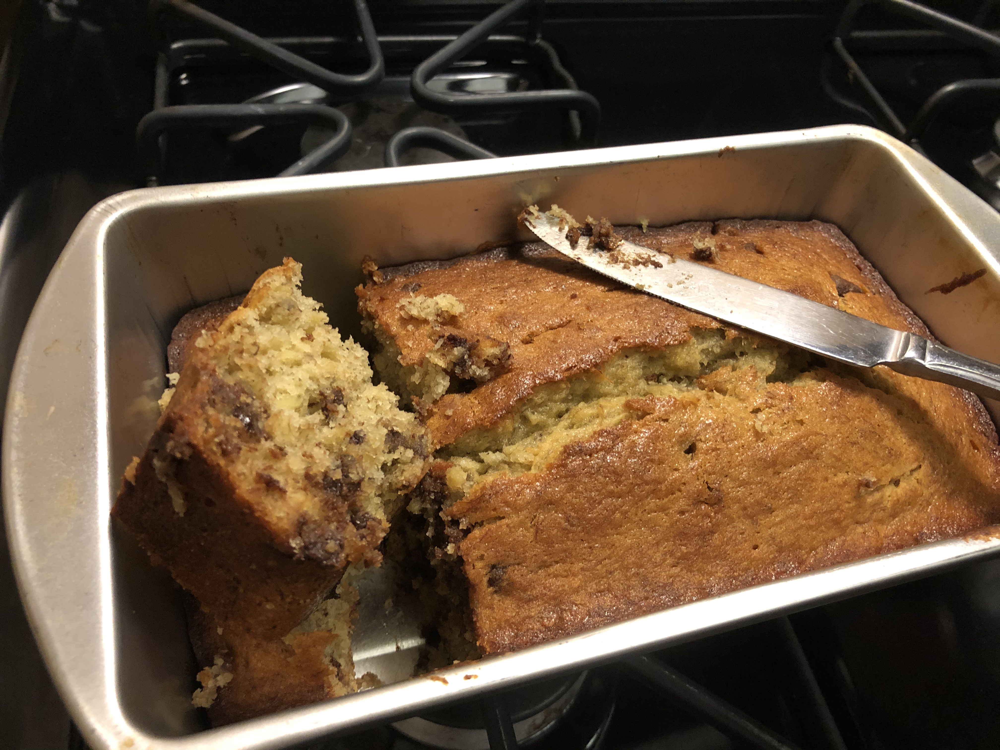

<!-- Do not modify sections with "AUTO-*". They are updated by make.py -->

# Banana Bread

<!-- rating=3; (User can specify rating on scale of 1-5) -->
<!-- AUTO-UserRating -->
Personal rating: :fontawesome-solid-star: :fontawesome-solid-star: :fontawesome-solid-star: :fontawesome-regular-star: :fontawesome-regular-star:
<!-- /AUTO-UserRating -->

<!-- AUTO-Image -->
{: .image-recipe loading=lazy }
<!-- /AUTO-Image -->

## Ingredients

* [ ] 1-Dry
    * [ ] 1.5 cups Flour
    * [ ] 1.5 tsp baking powder
    * [ ] 1/2 tsp salt
* [ ] 2-Wet
    * [ ] 2/3 cup sugar
    * [ ] 6 tbsp butter, softened
* [ ] 3-Beat-In
    * [ ] 1-2 large eggs, beaten
    * [ ] 1-1.25 cups mashed ripe bananas (about 3 medium or 2 large bananas)
* [ ] 4-Fold In
    * [ ] 1/2 cup chocolate chips
    * [ ] 1/2 cup chopped walnuts (optional)
    * [ ] 1/4 cup finely chopped dried apricots (optional)
    * [ ] etc (optional)

## Recipe

* Have all ingredients at room temperature. Preheat the oven to 350. Grease an 8.5 x 4.5 in loaf pan
* Whisk together the dry ingredients
* In a large bowl, beat at medium speed the sugar and butter until creamy
* Beat in the eggs and ripe bananas
* In about 3 parts, add the dry ingredients and beat until smooth
* Fold in optional ingredients (chocolate chips, chopped nuts, etc.)
* Scrape batter into greased pan and bake about 1 hour or until inserted toothpick comes out clean. Cool slightly then unmold. Cool completely before slicing

## Notes

* Source Joy of Cooking 75th edition, page 628. Banana Bread Cockaigne
* Note: removed the lemon zest from recipe
