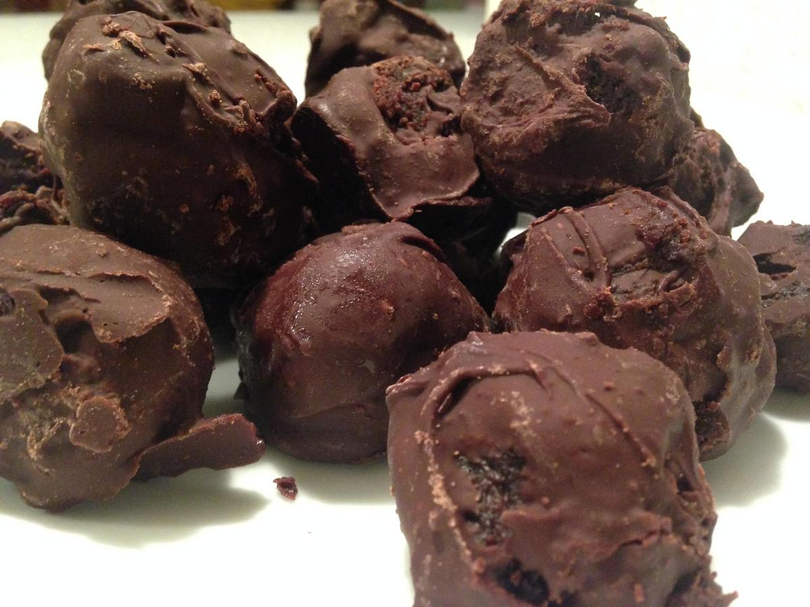

<!-- Needs Manual Review -->

# Cake Pops

<!-- rating=1; (User can specify rating on scale of 1-5) -->
<!-- AUTO-UserRating -->
Personal rating: :fontawesome-solid-star: :fontawesome-solid-star: :fontawesome-solid-star: :fontawesome-solid-star: :fontawesome-regular-star: :fontawesome-regular-star: :fontawesome-regular-star: :fontawesome-regular-star:
<!-- /AUTO-UserRating -->

<!-- name_image=cake_pops.jpg; (User can specify image name) -->
<!-- AUTO-Image -->
{: .image-recipe loading=lazy }
<!-- /AUTO-Image -->

## Ingredients

* [ ] Cake Mix
* [ ] Frosting
* [ ] 16 oz Semi-Sweet Chocolate Chips

## Recipe

* Bake a cake according to the instructions and let cool.
* Crumble the cake into a large mixing bowl and combine with the frosting. Roll 1 inch balls onto a parchment-lined baking sheet.
* Put the chocolate morsels into a microwaveable bowl. Microwave on HIGH for 30 second intervals and stir in between (~2 minutes).
* Drop the Cake Pop balls into the melted chocolate, then carefully lift out with two forks to let the excess chocolate drip off and return to the baking pan.
* Refrigerate or freeze until firm.
