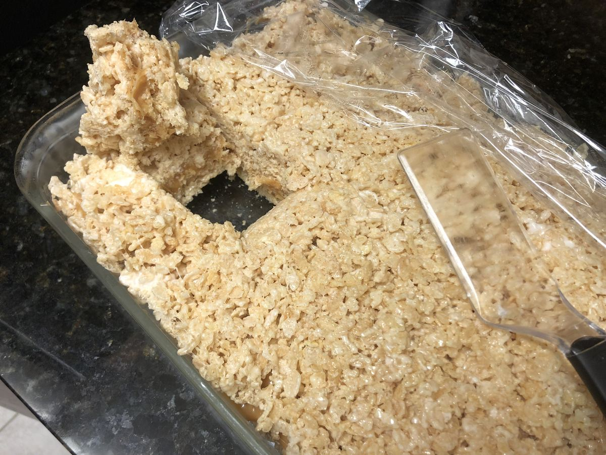

# Caramel Rice Krispies

> Based on [https://www.simplystacie.net/2021/01/caramel-rice-krispie-bars/](https://www.simplystacie.net/2021/01/caramel-rice-krispie-bars/)

<!-- {cts} rating=3; (User can specify rating on scale of 1-5) -->

Personal rating: :fontawesome-solid-star: :fontawesome-solid-star: :fontawesome-solid-star: :fontawesome-regular-star: :fontawesome-regular-star:

<!-- {cte} -->

<!-- {cts} name_image=caramel_rice_krispies.jpeg; (User can specify image name) -->

{: .image-recipe loading=lazy }

<!-- {cte} -->

## Ingredients

- [ ] Box Rice Krispies
- [ ] Bag Marshmallows
- [ ] Stick of Butter
- [ ] Half can of Sweetened Condensed Milk (optional)
- [ ] 10-15 oz Caramels (optional)

## Recipe

- Grease a glass pan
- In a large pot on low hear, melt 3 tbsp butter
    - Melt half of the marshmallows (5 oz)
    - Then mix in half of the rice krispies (~6 cups)
    - Remove and spread in the pan
- Scrape the pot clean, then return to low heat and melt 2 tbsp butter
    - Add the caramels and condensed milk. Raise the heat to medium-low and stir until melted
    - Pour and spread over the rice krispies in the pan
- Like before, melt the butter and marshmallows and remaining Rice Krispies. Spread on top of the caramel layer
- Place in the fridge to cool, then store on the counter
