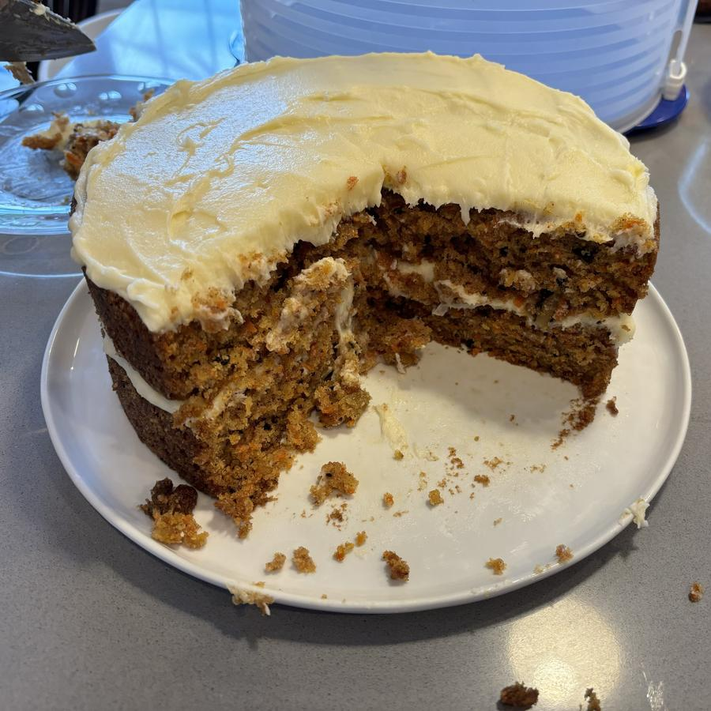

# Carrot Cake

> Based on [https://cooking.nytimes.com/recipes/1015523-carrot-cake](https://cooking.nytimes.com/recipes/1015523-carrot-cake)

<!-- {cts} rating=5; (User can specify rating on scale of 1-5) -->

Personal rating: :fontawesome-solid-star: :fontawesome-solid-star: :fontawesome-solid-star: :fontawesome-solid-star: :fontawesome-solid-star:

<!-- {cte} -->

<!-- {cts} name_image=carrot_cake.jpeg; (User can specify image name) -->

{.image-recipe}

<!-- {cte} -->

## Ingredients

### Cake

- [ ] 2 cups all-purpose flour
- [ ] 2 teaspoons baking powder
- [ ] 2 teaspoons baking soda
- [ ] 2 teaspoons ground cinnamon
- [ ] 4/4 teaspoon salt
- [ ] 3 cups grated carrots (you can grate the carrots in a food processor fitted with a shredding blade)
- [ ] 1 cup coarsely chopped walnuts or pecans
- [ ] 1 cup shredded coconut, sweetened or unsweetened
- [ ] ½ cup moist, plump raisins (dark or golden) or dried cranberries
- [ ] 2 cups sugar
- [ ] 1 cup canola or safflower oil
- [ ] 4 large eggs

### Frosting

- [ ] 8 ounces cream cheese, at room temperature
- [ ] 1 stick (8 tablespoons) unsalted butter, at room temperature
- [ ] 1 pound (3¾ cups) confectioners' sugar
- [ ] 1 tablespoon fresh lemon juice or ½ teaspoon pure lemon extract
- [ ] 1/2 cup shredded coconut, optional
- [ ] Toasted finely chopped nuts and/or toasted coconut, for topping, optional

## Recipe

- For the cake: Position the racks to divide the oven into thirds and preheat the oven to 325 degrees. Butter and flour three 9-inch round, 2-inch deep cake pans, flour the insides and tap out the excess.
- Whisk together the flour, cinnamon, baking powder, baking soda and salt and set aside. In another bowl, stir together the carrots, chopped nuts, coconut and raisins.
- Working in a mixer fitted with the paddle attachment, or in a large bowl with a whisk, beat the sugar and oil together until smooth. Add the eggs one by one and continue to beat until the batter is even smoother. If you are working in a mixer, reduce the speed to low, if you're working by hand switch to a large rubber spatula, and gently stir in the flour mixture — mix only until the dry ingredients disappear. Just as gently, stir in the chunky ingredients.
- Divide the batter among the baking pans and slide the pans into the oven. Bake the cakes for 40 to 50 minutes, rotating the pans top to bottom and front to back at the midway point. The cakes are properly baked when a knife inserted into the centers of the cakes comes out clean; the cakes will just start to come away from the edges. Transfer the pans to cooling racks, cool for 5 minutes, then turn out onto racks to cool to room temperature. (At this point, the cakes can be wrapped airtight and kept at room temperature overnight or frozen for up to 2 months; thaw before frosting.)
- For the frosting: Working in a mixer fitted with the paddle attachment, beat the cream cheese and butter together until smooth and creamy. Gradually add the confectioners' sugar and continue to beat until the frosting is velvety smooth. Beat in the lemon juice or extract.
- If you'd like to have coconut in the filling, scoop out about ½ of the frosting and stir the coconut into this portion.
- To frost the cake, place one layer of the cake, right-side up, on a cardboard round or a cake plate. If you've added coconut to the frosting, use half of coconut frosting to generously cover the first layer. Use an offset spatula or a spoon to smooth the frosting all the way to the edges of the layer. Top with the second layer, this time placing the cake top-side down. Frost with the remainder of the coconut frosting. Top with the last layer, right-side up and use the plain frosting to cover the top — and the sides, if you want – of the cake. Finish the top layer with swirls of frosting. If you want to top the cake with toasted nuts or coconut, sprinkle on these ingredients now, while the frosting is soft. Slide the cake into the refrigerator for 15 minutes, just to set the frosting.
- Serving: The cake can be served as soon as the frosting is set. It can also wait, at room temperature and covered with a cake keeper, overnight. The cake is best served in thick slices at room temperature and, while it's good plain, it's better with whipped cream, vanilla ice cream or even some lemon curd with a little whipped cream folded in.
- Storing: Covered the cake will keep at room temperature for 2 to 3 days. It can also be frozen, uncovered, and then, when it is firmed, wrapped airtight and kept in the freezer for up to 2 months; defrost, still wrapped, in the refrigerator overnight.
