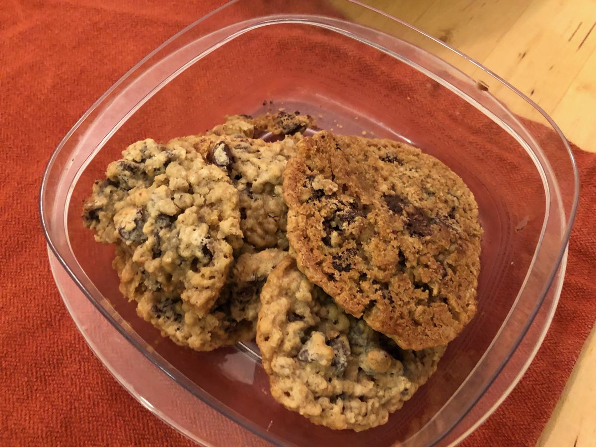

<!-- Do not modify sections with "AUTO-*". They are updated by make.py -->

# Chocolate Chip Cookies

> Based on [https://www.verybestbaking.com/recipes/32014/original-nestle-toll-house-milk-chocolate-chip-cookies/](https://www.verybestbaking.com/recipes/32014/original-nestle-toll-house-milk-chocolate-chip-cookies/)

<!-- rating=4; (User can specify rating on scale of 1-5) -->
<!-- AUTO-UserRating -->
Personal rating: :fontawesome-solid-star: :fontawesome-solid-star: :fontawesome-solid-star: :fontawesome-solid-star: :fontawesome-solid-star: :fontawesome-solid-star: :fontawesome-solid-star: :fontawesome-regular-star:
<!-- /AUTO-UserRating -->

<!-- name_image=chocolate_chip_cookies.jpeg; (User can specify image name) -->
<!-- AUTO-Image -->
{: .image-recipe loading=lazy }
<!-- /AUTO-Image -->

## Ingredients

* [ ] 2.25 cups all-purpose flour
* [ ] 1 tsp baking soda
* [ ] 1 tsp salt
* [ ] 1 cup (2 sticks) butter, softened
* [ ] 3/4 cup granulated sugar
* [ ] 3/4 cup brown sugar, packed
* [ ] 1 tsp vanilla extract
* [ ] 2 large eggs
* [ ] 2 cups (12 oz) chocolate chips
* [ ] 1 cup chopped nuts or additional 1-2 tbsp flour

## Recipe

* Soften butter at room temperature
* Preheat oven to 375F
* In a small bowl, combine flour, baking soda, and salt
* In a large mixing bowl, combine butter, sugars, and vanilla extract until creamy
    * Add eggs one at a time beating well
    * Beat in flour gradually
    * Stir in morsels and nuts/flour
* Measure out rounded tbsp of dough on a light colored ungreased baking sheet
* Bake 9-11 minutes until golden brown. Cool the baking sheet for 2 min on a wire rack, then transfer cookies to a wire rack

## Notes

* Also see the alternative [Chocolate Chip Oatmeal Cookies](./chocolate_chip_oatmeal_cookies.md)
    * And [a Peanut Butter version](https://www.verybestbaking.com/recipes/144792/peanut-butter-chocolate-chip-cookies/)
    * Or [chunky chocolate chip peanut butter cookies](https://www.verybestbaking.com/recipes/30364/chunky-chocolate-chip-peanut-butter-cookies/)
