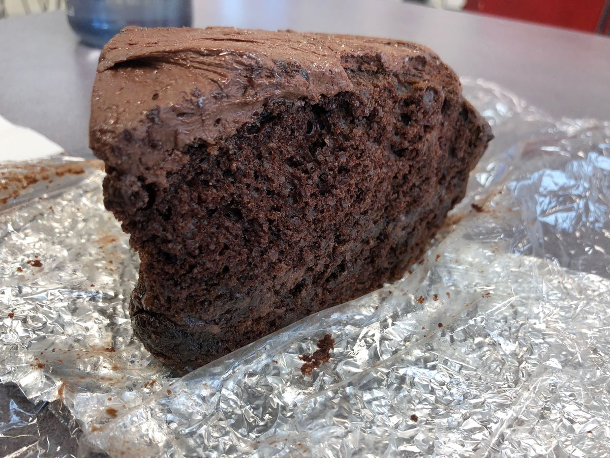

<!-- Do not modify. Auto-generated with mkdocs_migrate.py -->

# Chocolate Frosting Recipe

> Based on [https://www.kingarthurflour.com/recipes/super-simple-chocolate-frosting-recipe](https://www.kingarthurflour.com/recipes/super-simple-chocolate-frosting-recipe)

Personal rating: :fontawesome-solid-star: :fontawesome-solid-star: :fontawesome-solid-star: :fontawesome-regular-star: :fontawesome-regular-star:

<!-- Image -->
{: .image-recipe loading=lazy }
<!-- /Image -->

## Ingredients

* [ ] 1.75 cups unsweetened cocoa powder, sifted
* [ ] 1.5 cups powdered sugar
* [ ] 2 cups powdered sugar, sifted
* [ ] (optional) 1 tsp espresso powder
* [ ] 1 cup heavy cream
* [ ] 2 cups unsalted butter, very soft/at room temp
* [ ] 1/8 tsp salt
* [ ] 2 tsp vanilla extract
* [ ] (Optional) Betty Crocker Double Fudge Boxed Cake Mix
* [ ] (Optional) Raspberry Jelly

## Recipe

* (Optional) Make a cake with 2-3 round layers
* (Optional) For the fruit filling between the layers, warm up the jelly until liquid-like and spread over the cake. Poke a few vertical holes so the jelly gets inside
* Then frost!
* In a medium bowl, add the cocoa powder and *1.5 cups powdered sugar (and optional espresso powder)
* Bring the cream to a simmer on the stove or in the microwave, and whisk into the cocoa mixture. Whisk until smooth (non-grainy). Set aside to cool to room temp
* In a large bowl, beat together the butter, salt, and *2 cups of sifted powdered sugar until smooth and fluffy. Then mix in the vanilla
* With the mixer running on low speed, add the cocoa mixture a spoonful at a time until it's all incorporated. Scrape the bowl, then beat at medium speed for an additional minute

## Notes

* Yield: 4 1/2 cups, enough to frost 2 dozen cupcakes, or fill/frost an 8-9 in layer cake
* Never frost a warm cake: the frosting will sink in, or the cake will tear (chill or freeze the cake for 30 min if needed)
