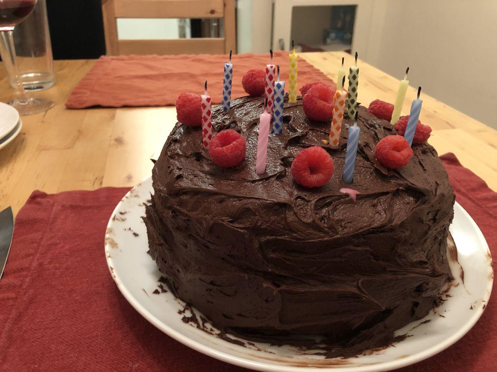

# Chocolate Frosting Recipe

> Based on [https://www.kingarthurflour.com/recipes/super-simple-chocolate-frosting-recipe](https://www.kingarthurflour.com/recipes/super-simple-chocolate-frosting-recipe)

<!-- {cts} rating=4; (User can specify rating on scale of 1-5) -->

Personal rating: :fontawesome-solid-star: :fontawesome-solid-star: :fontawesome-solid-star: :fontawesome-solid-star: :fontawesome-solid-star: :fontawesome-solid-star: :fontawesome-solid-star: :fontawesome-regular-star:

<!-- {cte} -->

<!-- {cts} name_image=chocolate_frosting_recipe.jpg; (User can specify image name) -->

{: .image-recipe loading=lazy }

<!-- {cte} -->

## Ingredients

* [ ] 1.75 cups unsweetened cocoa powder, sifted
* [ ] 1.5 cups powdered sugar
* [ ] 2 cups powdered sugar, sifted
* [ ] (optional) 1 tsp espresso powder
* [ ] 1 cup heavy cream
* [ ] 4 sticks of butter, soft and at room temp
* [ ] 1/8 tsp salt
* [ ] 2 tsp vanilla extract
* [ ] (Optional) Betty Crocker Double Fudge Boxed Cake Mix
* [ ] (Optional) Raspberry Jelly

## Recipe

* (Optional) Make a cake with 2-3 round layers
    * Make sure to loosen the cakes by running the icing spatula around the sides before knocking out
    * Cut off the round dome off to ensure a flat surface for stacking the cakes
* (Optional) For the fruit filling between the layers, warm up the jelly until liquid-like and spread over the cake. Poke a few vertical holes so the jelly gets inside
* Then frost!
    * In a medium bowl, add the cocoa powder and *1.5 cups* powdered sugar (and optional espresso powder)
    * Microwave the cream in a small glass bowl for 2 minutes until very hot and whisk into the cocoa mixture
        * Whisk until smooth (non-grainy). Set aside in the fridge to cool to room temp
    * In a large bowl with a wooden spoon, mix together the butter, salt, and *2 cups* of sifted powdered sugar until smooth and fluffy
    * Then mix in the vanilla and slowly add the cocoa mixture until all incorporated
* Evenly spread the icing with a spatula; rotate the cake to help evenly ice

## Notes

* Yield: 4 1/2 cups, enough to frost 2 dozen cupcakes, or fill/frost an 8-9 in layer cake
* Never frost a warm cake: the frosting will sink in, or the cake will tear (chill or freeze the cake for 30 min if needed)
