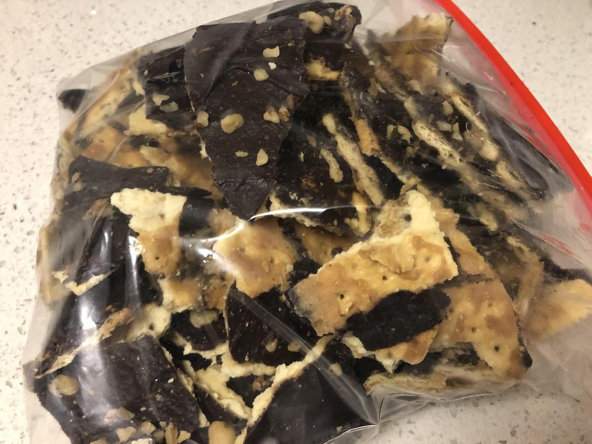

<!-- Do not modify sections with "AUTO-*". They are updated by make.py -->

# Chocolatines

> Source: Alex's family recipe

<!-- rating=5; (User can specify rating on scale of 1-5) -->
<!-- AUTO-UserRating -->
Personal rating: :fontawesome-solid-star: :fontawesome-solid-star: :fontawesome-solid-star: :fontawesome-solid-star: :fontawesome-solid-star: :fontawesome-solid-star: :fontawesome-solid-star: :fontawesome-solid-star:
<!-- /AUTO-UserRating -->

<!-- name_image=chocolatines.jpeg; (User can specify image name) -->
<!-- AUTO-Image -->
{: .image-recipe loading=lazy }
<!-- /AUTO-Image -->

## Ingredients

* [ ] 1/2 box saltines
* [ ] 2 sticks butter
* [ ] 1 cup brown sugar, packed
* [ ] at least 2 cups of chocolate chips (any type)
* [ ] Optional toppings: chopped peanuts, candy canes, chocolate chips, pretzels, etc.

## Recipe

* Preheat the oven to 350F
* Line a large baking sheet with tin foil and apply non-stick spray
* Spread out saltines in a single layer
* In a large pot, melt the butter then mix with the brown sugar and bring to a boil. Once at a boil, simmer on low heat for 4 minutes without stirring
* Pour the butter and brown sugar over the saltines. Spread evenly with a spatula then put in the oven for 5 minutes
* Take out of the oven and sprinkle with chocolate chips. The residual heat will melt the chips so they can be spread into a thin layer with a spatula
* Add any additional toppings, then freeze for at least 1 hour
* Break into bite size chunks! Can be stored in the fridge or on the counter

!!! Warning
    FYI, choose a backing sheet that will fit in your freezer
