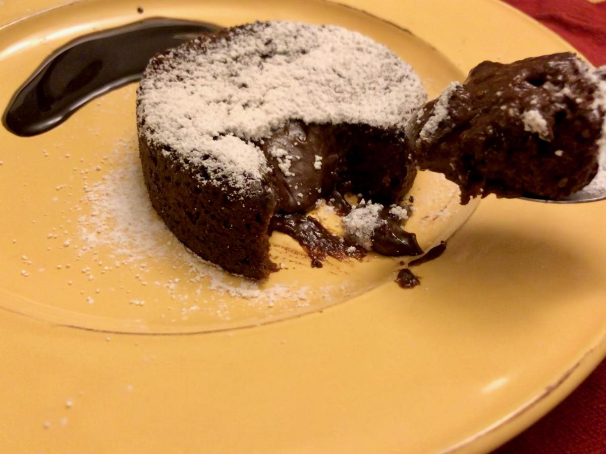

<!-- Needs Manual Review -->

<!-- Do not modify sections with "AUTO-*". They are updated by make.py -->

# Molten Chocolate Cake

> Based on [http://spoonuniversity.com/recipe/valentines-chocolate-cake](http://spoonuniversity.com/recipe/valentines-chocolate-cake)

<!-- rating=3; (User can specify rating on scale of 1-5) -->
<!-- AUTO-UserRating -->
Personal rating: :fontawesome-solid-star: :fontawesome-solid-star: :fontawesome-solid-star: :fontawesome-solid-star: :fontawesome-solid-star: :fontawesome-solid-star: :fontawesome-regular-star: :fontawesome-regular-star:
<!-- /AUTO-UserRating -->

<!-- name_image=molten_chocolate_cake.jpeg; (User can specify image name if multiple exist) -->
<!-- AUTO-Image -->
{: .image-recipe loading=lazy }
<!-- /AUTO-Image -->

## Ingredients

* [ ] 2 medium-sized ramekins
* [ ] Cocoa powder
* [ ] 0.5 tablespoon unsalted butter, melted
* [ ] 3.5 tbsp unsalted butter, cut into cubes
* [ ] 50g 70% dark chocolate bar
* [ ] 1 egg, room temperature
* [ ] 1 egg yolk
* [ ] 1/4 cup sugar
* [ ] 1/3 cup & 1 tbsp flour
* [ ] pinch salt
* [ ] Powdered sugar, for dusting
* [ ] Vanilla Ice Cream

## Recipe

* Preheat the oven to 400
* Grease 2 ramekins with the melted butter and dust with cocoa powder
* Melt the chocolate and rest of the butter. Set aside to cool
* Beat the egg, yolk, and sugar until thick and pale
* Fold in the butter/chocolate
* With a sift, slowly add the flour and fold in
* Pour the mixture into the ramekins. Bake for 10 minutes +/- 30 seconds
* Let cool for two minutes, then careful flip the ramekin and tap out the cake. Dust with powdered sugar

## Notes

* Recipe cut in half for 2 cakes
