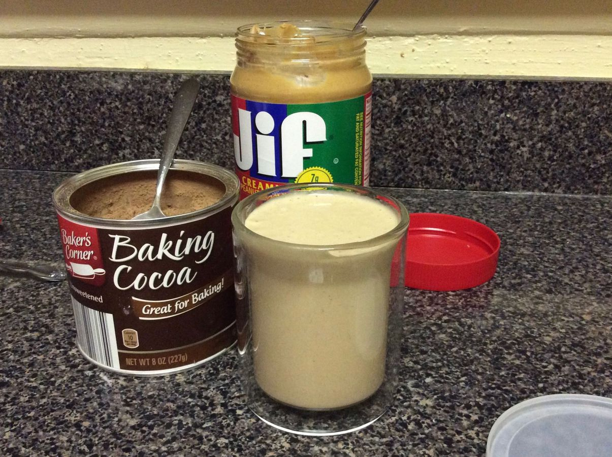

<!-- Needs Manual Review -->

<!-- Do not modify sections with "AUTO-*". They are updated by make.py -->

# Peanut Butter And Cocoa Smothie

<!-- rating=1; (User can specify rating on scale of 1-5) -->
<!-- AUTO-UserRating -->
Personal rating: :fontawesome-solid-star: :fontawesome-solid-star: :fontawesome-solid-star: :fontawesome-solid-star: :fontawesome-regular-star: :fontawesome-regular-star: :fontawesome-regular-star: :fontawesome-regular-star:
<!-- /AUTO-UserRating -->

<!-- name_image=peanut_butter_and_cocoa_smothie.jpg; (User can specify image name if multiple exist) -->
<!-- AUTO-Image -->
{: .image-recipe loading=lazy }
<!-- /AUTO-Image -->

## Ingredients

* [ ] yogurt
* [ ] 1-2 spoons of peanut butter
* [ ] banana
* [ ] spoon of cocoa powder
* [ ] some water (or milk) to thin the mixture

## Recipe

* Blend!
