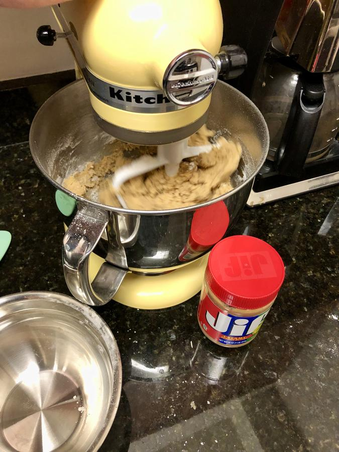

# Peanut Butter Cookies

> Based on [https://www.simplyrecipes.com/recipes/peanut_butter_cookies/](https://www.simplyrecipes.com/recipes/peanut_butter_cookies/)

<!-- {cts} rating=5; (User can specify rating on scale of 1-5) -->

Personal rating: :fontawesome-solid-star: :fontawesome-solid-star: :fontawesome-solid-star: :fontawesome-solid-star: :fontawesome-solid-star: :fontawesome-solid-star: :fontawesome-solid-star: :fontawesome-solid-star:

<!-- {cte} -->

<!-- {cts} name_image=peanut_butter_cookies.jpeg; (User can specify image name) -->

{: .image-recipe loading=lazy }

<!-- {cte} -->

## Ingredients

### Wet

- [ ] 1/2 cup butter, room temperature
- [ ] 1/2 cup granulated sugar
- [ ] 1/2 cup packed brown sugar
- [ ] 1/2 cup peanut butter
- [ ] 1 large egg

### Dry

- [ ] 1.25 cups flour
- [ ] 3/4 tsp baking soda
- [ ] 1/2 tsp baking powder
- [ ] 1/4 tsp salt

## Recipe

- In the KitchenAid:
    - Beat the butter until creamy (~2 min)
    - Add brown sugar and white sugar (~2 min)
    - Mix in the peanut butter and the egg
- In the smallest bowl, whisk together the dry ingredients
- Mix in the dry ingredients
- Wrap dough and refrigerate for several hours
- Base at 375F for 9-10 minutes
- Shape cookies into balls, then press with a fork
