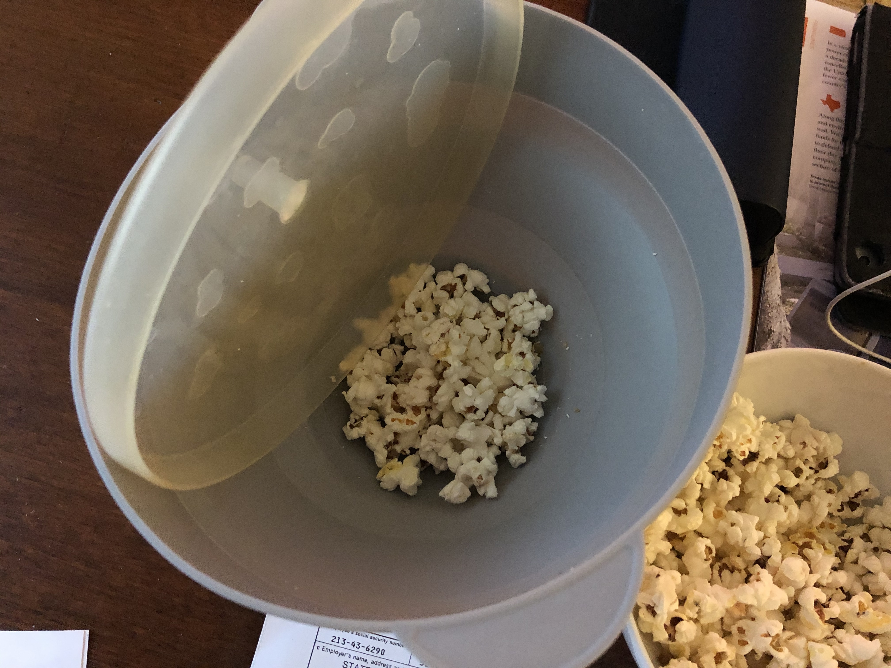

<!-- Needs Manual Review -->

# Popcorn

> Based on [https://www.amazon.com/Colonel-Popper-Microwave-Collapsible-Dishwasher/dp/B01NBR3DBP](https://www.amazon.com/Colonel-Popper-Microwave-Collapsible-Dishwasher/dp/B01NBR3DBP)

<!-- {cts} rating=2; (User can specify rating on scale of 1-5) -->

Personal rating: :fontawesome-solid-star: :fontawesome-solid-star: :fontawesome-solid-star: :fontawesome-solid-star: :fontawesome-solid-star: :fontawesome-regular-star: :fontawesome-regular-star: :fontawesome-regular-star:

<!-- {cte} -->

<!-- {cts} name_image=popcorn.jpeg; (User can specify image name) -->

{: .image-recipe loading=lazy }

<!-- {cte} -->

## Ingredients

- [ ] 1/4 cup kernels

## Recipe

- Place in popper and cook for 2:20 in our 900 watt microwave

## Notes

- Try mixing with chocolate chips while the popcorn is hot so that the chocolate will melt
