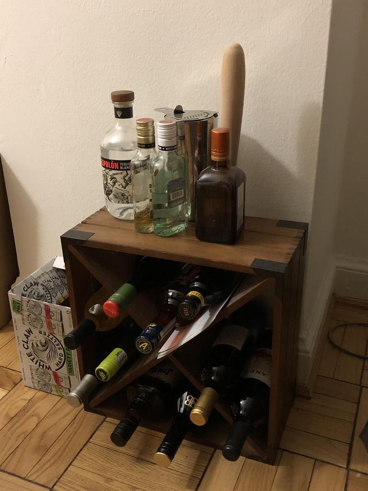

# Bottle Guide

<!-- rating=5; (User can specify rating on scale of 1-5) -->
<!-- AUTO-UserRating -->
Personal rating: :fontawesome-solid-star: :fontawesome-solid-star: :fontawesome-solid-star: :fontawesome-solid-star: :fontawesome-solid-star: :fontawesome-solid-star: :fontawesome-solid-star: :fontawesome-solid-star:
<!-- /AUTO-UserRating -->

<!-- name_image=_bottle_guide.jpeg; (User can specify image name) -->
<!-- AUTO-Image -->
{: .image-recipe loading=lazy }
<!-- /AUTO-Image -->

## Notes

When a drink recipe calls for `"___"` this guide helps with a couple of suggestions

* *Blanco Tequila*
    * Espolon Blanco: best value for <$30
    * Patron Silver: used for first margaritas, but too strong
