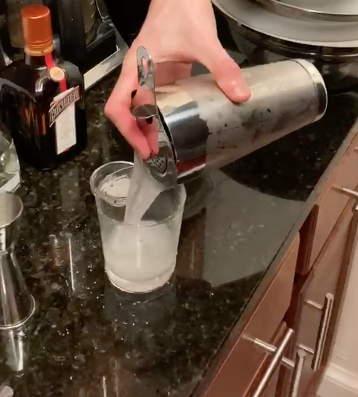

<!-- Do not modify. Auto-generated with mkdocs_migrate.py -->

# Margarita

Personal rating: :fontawesome-regular-star: :fontawesome-regular-star: :fontawesome-regular-star: :fontawesome-regular-star: :fontawesome-regular-star:

<!-- Image -->
{: .image-recipe loading=lazy }
<!-- /Image -->

## Ingredients

* [ ] Classic
    * [ ] Lime wedge
    * [ ] Kosher salt, for rim
    * [ ] 2 oz Siembra Azul (blanco tequila)
    * [ ] 3/4 oz Cointreau
    * [ ] 3/4 oz fresh lime juice
    * [ ] 1/4 oz simple syrup (see recipe in Drinks section)
* [ ] Dry
    * [ ] Lime wedge
    * [ ] Kosher salt, for rim
    * [ ] 2 oz Siembra Azul (blanco tequila)
    * [ ] 3/4 oz Cointreau
    * [ ] 3/4 oz fresh lime juice
* [ ] Sweet
    * [ ] Lime wedge
    * [ ] Kosher salt, for rim
    * [ ] 2 oz Siembra Azul (blanco tequila)
    * [ ] 3/4 oz Cointreau
    * [ ] 3/4 oz fresh lime juice
    * [ ] 1/2 oz simple syrup (see recipe in Drinks section)

## Recipe

* Run the lime wedge along the upper 1/2 in of an Old Fashioned glass halfway around the circumference
* Roll wet portion in salt and put 1 large ice cube in the glass
* Shake the ingredients with ice, then strain into the prepared glass. No garnish

## Notes

* Source: Cocktail Codex - SideCar Variant
* Variations just modify the amount of simple syrup added
* Used silver patron, but didn't have much flavor
