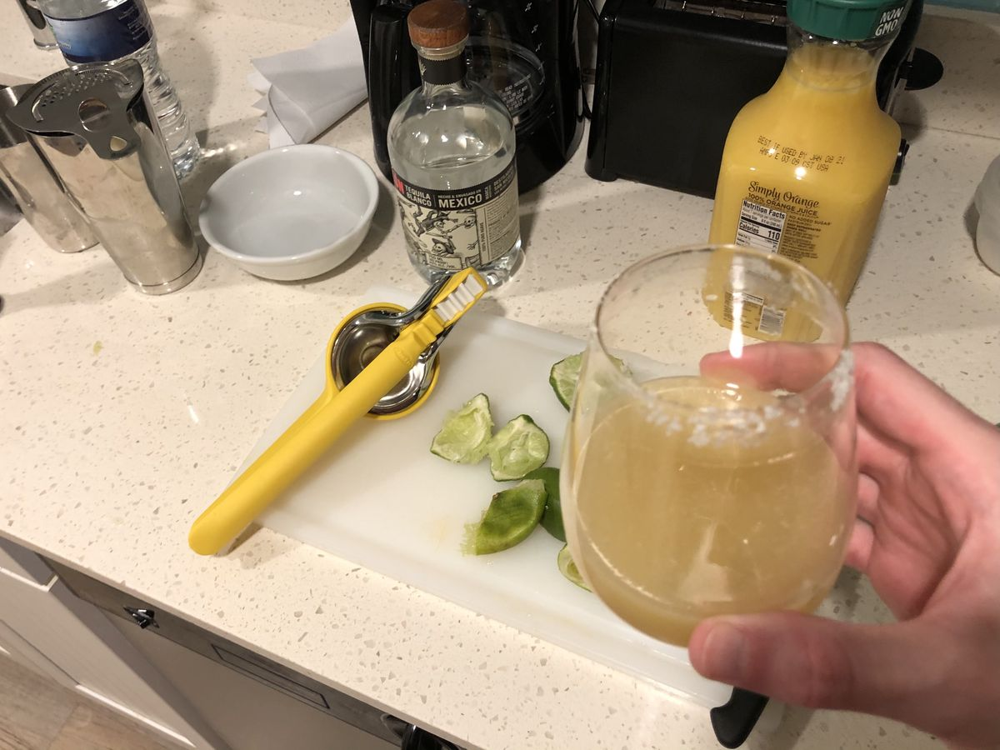

<!-- Do not modify sections with "AUTO-*". They are updated by make.py -->

# Spicy Margarita

> Based on a post by [Chrissy Teigen on Instagram](https://www.instagram.com/p/CEmz6BOHzRM)

<!-- rating=3; (User can specify rating on scale of 1-5) -->
<!-- AUTO-UserRating -->
Personal rating: :fontawesome-solid-star: :fontawesome-solid-star: :fontawesome-solid-star: :fontawesome-solid-star: :fontawesome-solid-star: :fontawesome-solid-star: :fontawesome-regular-star: :fontawesome-regular-star:
<!-- /AUTO-UserRating -->

<!-- name_image=spicy_margarita.jpg; (User can specify image name) -->
<!-- AUTO-Image -->
{: .image-recipe loading=lazy }
<!-- /AUTO-Image -->

## Ingredients

Makes 2 drinks

* Drink
    * [ ] 4 oz blanco tequila⁠
    * [ ] 3 oz fresh lime juice
    * [ ] 1.5 oz orange juice⁠
    * [ ] 1 oz agave syrup (or possibly substitute simple syrup)⁠
    * [ ] 3-4 rounds sliced from a small jalapeño
* Garnish
    * [ ] Lime wheels
    * [ ] Kosher salt, for rimming the glasses⁠

## Recipe

* Combine ingredients in a shaker
* Salt the glasses and add ice cubes
* Add ice cubes in the shaker, shake, and strain
    * Optionally, toss in a one or two jalapeño rounds for garnish

## Notes

- Originally made with maple syrup, but the flavor was too strong, so stick with agave or simple syrup
