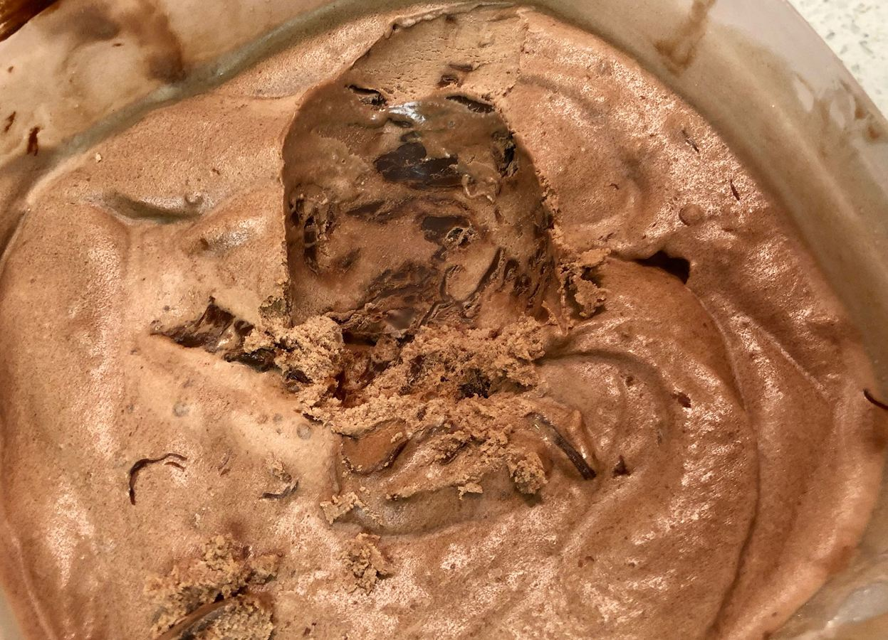

<!-- Do not modify. Auto-generated with mkdocs_migrate.py -->

# Chocolate Nutella

> Based on [https://www.cuisinart.com/share/pdf/manuals/ice-21.pdf](https://www.cuisinart.com/share/pdf/manuals/ice-21.pdf)

Personal rating: :fontawesome-solid-star: :fontawesome-solid-star: :fontawesome-solid-star: :fontawesome-regular-star: :fontawesome-regular-star:

<!-- Image -->
{: .image-recipe loading=lazy }
<!-- /Image -->

## Ingredients

* [ ] 1/4 cup packed dark brown sugar
* [ ] 2/3 cup cocoa powder, sifted
* [ ] 1/2 cup granulated sugar
* [ ] pinch salt
* [ ] 1 cup whole milk
* [ ] 2 cups heavy cream
* [ ] 1/2 tablespoon pure vanilla extract
* [ ] (optional) Nutella or Peanut Butter
* [ ] Cuisinart ice cream maker

## Recipe

* In a large bowl, whisk together the dry ingredients. Add the milk and beat until combined.
* Gently mix in the heavy cream and vanilla. Cover and refrigerate for at least 1 hour (preferably overnight)
* Pour the mixture into the ice cream maker and let spin until thickened (15-20 min)
* Move to a tupperware container and freeze for 30 min to 1 hour to thicken
* With a knife and in small spoon fulls, swirl in the Nutella or Peanut Butter. There should be clear layers or at least chunks
