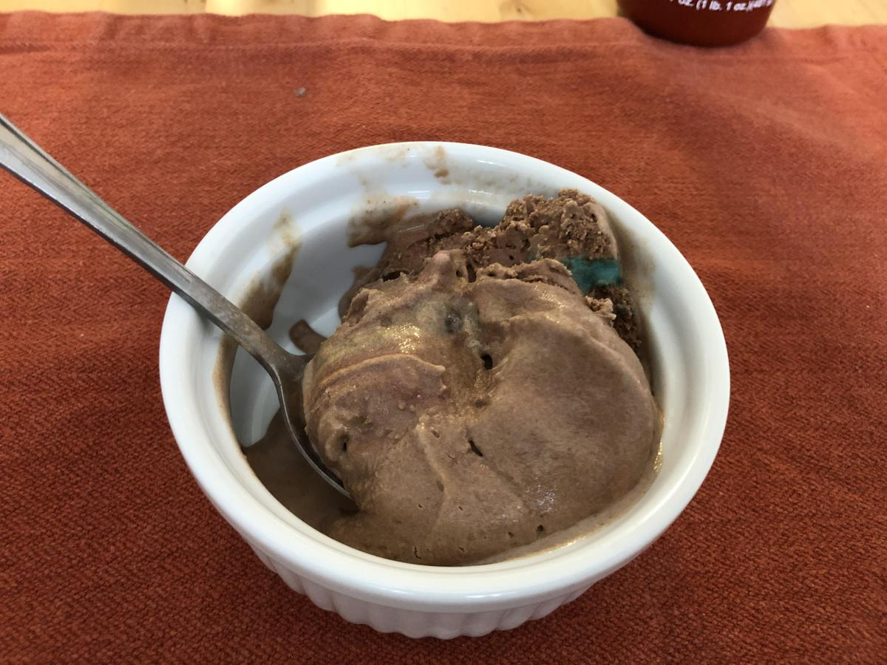

<!-- Do not modify sections with "AUTO-*". They are updated by make.py -->

# Frozen M&M

> Based on [https://www.cuisinart.com/share/pdf/manuals/ice-21.pdf](https://www.cuisinart.com/share/pdf/manuals/ice-21.pdf)

<!-- rating=3; (User can specify rating on scale of 1-5) -->
<!-- AUTO-UserRating -->
Personal rating: :fontawesome-solid-star: :fontawesome-solid-star: :fontawesome-solid-star: :fontawesome-regular-star: :fontawesome-regular-star:
<!-- /AUTO-UserRating -->

<!-- name_image=frozen_m&m.jpeg; (User can specify image name if multiple exist) -->
<!-- AUTO-Image -->
{: .image-recipe loading=lazy }
<!-- /AUTO-Image -->

## Ingredients

* [ ] 1/4 cup cocoa powder
* [ ] M&Ms/Oreos/Cookies/Graham Crackers/etc, crushed

## Recipe

* Follow the vanilla ice cream recipe, just add a small amount of cocoa powder to give a pleasant chocolate flavor
