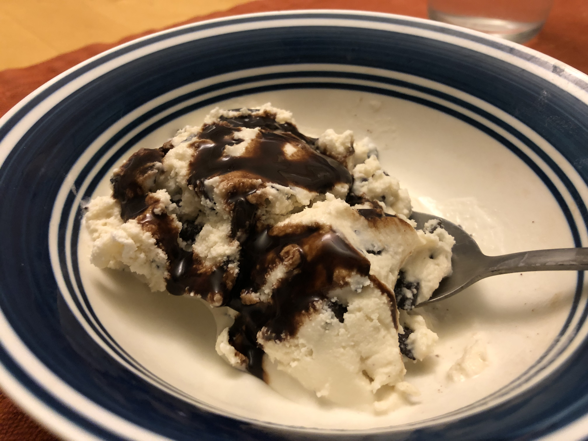

<!-- Needs Manual Review -->

<!-- Do not modify sections with "AUTO-*". They are updated by make.py -->

# Mint Chocolate Chunk

> Based on [https://www.cuisinart.com/share/pdf/manuals/ice-21.pdf](https://www.cuisinart.com/share/pdf/manuals/ice-21.pdf)

<!-- rating=2; (User can specify rating on scale of 1-5) -->
<!-- AUTO-UserRating -->
Personal rating: :fontawesome-solid-star: :fontawesome-solid-star: :fontawesome-solid-star: :fontawesome-solid-star: :fontawesome-solid-star: :fontawesome-regular-star: :fontawesome-regular-star: :fontawesome-regular-star:
<!-- /AUTO-UserRating -->

<!-- name_image=mint_chocolate_chunk.jpeg; (User can specify image name) -->
<!-- AUTO-Image -->
{: .image-recipe loading=lazy }
<!-- /AUTO-Image -->

## Ingredients

* [ ] 3/4 cup granulated sugar
* [ ] pinch salt
* [ ] 1 cup whole milk
* [ ] 2 tbsp peppermint extract
* [ ] (TBD) tsp green food coloring
* [ ] 3/4 teaspoon pure vanilla extract
* [ ] 2 cups heavy cream
* [ ] (optional) 10-12 chopped peppermint patties
* [ ] 1-1.5 cups chocolate chunks/chips
* [ ] Cuisinart ice cream maker

## Recipe

* In a large bowl, whisk together the dry ingredients. Add the milk and beat until combined.
* Gently mix in the heavy cream and vanilla. Cover and refrigerate for at least 1 hour (preferably overnight)
* Pour the mixture into the ice cream maker and let spin until thickened (15-20 min).
* Five minutes before mixing is completed, gradually add the chocolate chunks and/or peppermint patties and let mix in completely

## Notes

* Probably better with real mint. The extract just ends up with a fake mint flavor. See Cuisinart recipe for how to prep with fresh mint leaves
