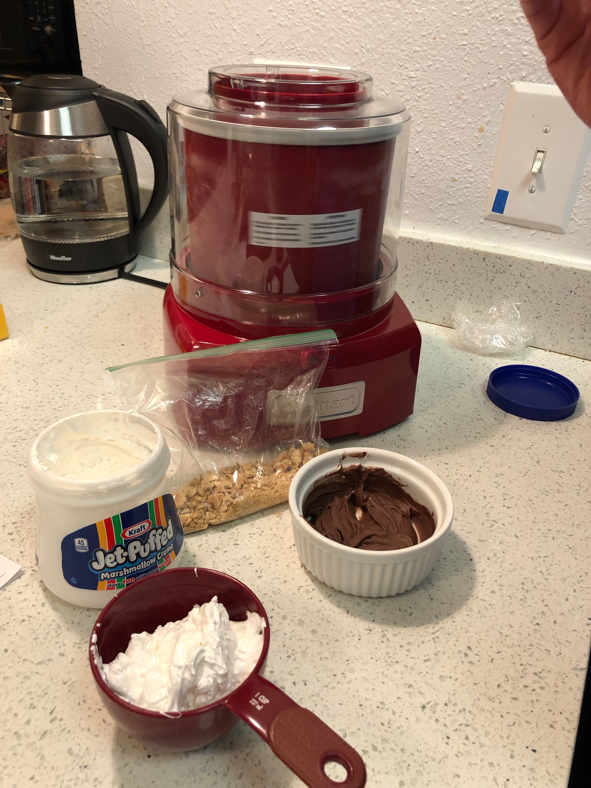

<!-- Do not modify sections with "AUTO-*". They are updated by make.py -->

# S'Mores Ice Cream

> Based on [https://www.cuisinart.com/share/pdf/manuals/ice-21.pdf](https://www.cuisinart.com/share/pdf/manuals/ice-21.pdf)

<!-- rating=3; (User can specify rating on scale of 1-5) -->
<!-- AUTO-UserRating -->
Personal rating: :fontawesome-solid-star: :fontawesome-solid-star: :fontawesome-solid-star: :fontawesome-solid-star: :fontawesome-solid-star: :fontawesome-solid-star: :fontawesome-regular-star: :fontawesome-regular-star:
<!-- /AUTO-UserRating -->

<!-- name_image=smores_ice_cream.jpeg; (User can specify image name) -->
<!-- AUTO-Image -->
{: .image-recipe loading=lazy }
<!-- /AUTO-Image -->

## Ingredients

* [ ] 1/2 cup cocoa powder, sifted
* [ ] 1/3 cup granulated sugar
* [ ] 1/4 cup packed dark brown sugar
* [ ] pinch salt
* [ ] 2/3 cup whole milk
* [ ] 1.5 cups heavy cream
* [ ] 3/4 teaspoon pure vanilla extract
* [ ] 2 cup marshmallow cream (e.g. Fluff®)
* [ ] 2 full Graham Crackers, crushed
* [ ] 2 ounces milk chocolate (1∕3 cup chips), melted and reserved at room temperature
* [ ] Cuisinart ice cream maker

## Recipe

* In a large bowl, whisk together cocoa powder, granulated sugar, brown sugar, and salt. Add the milk and beat until combined.
* Gently mix in the heavy cream and vanilla. Cover and refrigerate for at least 1 hour (preferably overnight)
* Pour the mixture into the ice cream maker and let spin until thickened (15-20 min).
* Five minutes before mixing is completed, gradually add the marshmallow cream, one spoonful at a time. Once mixed, slowly add the crushed graham crackers and melted chocolate and let mix in completely

## Notes

* Tip: If marshmallow cream is too stiff, warm slightly in microwave before adding to freezer bowl
* When next making, check out [this Washington Post variant](https://www.washingtonpost.com/recipes/smores-ice-cream/17060/)
