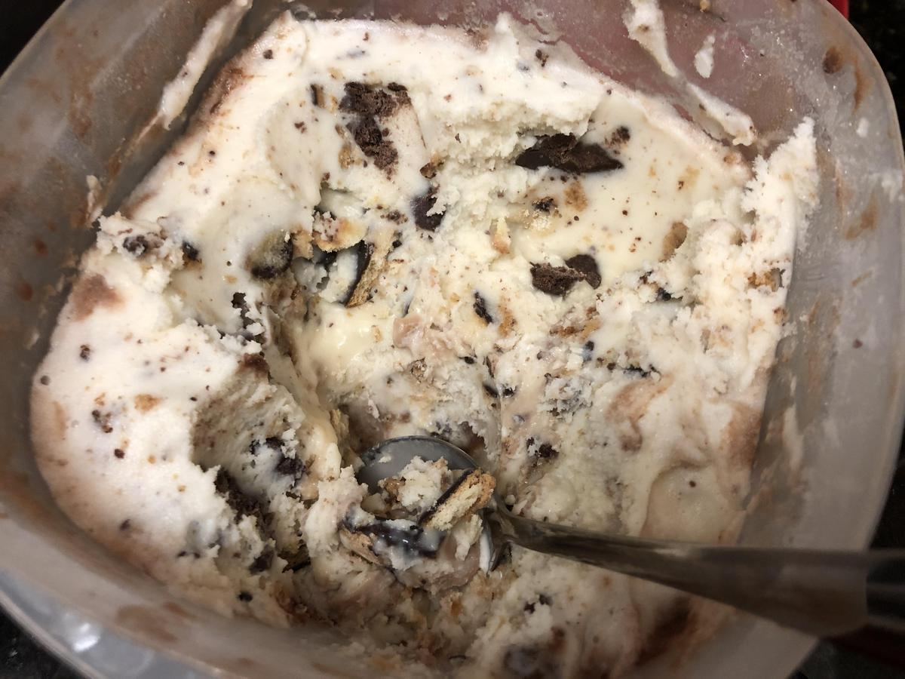

<!-- Do not modify sections with "AUTO-*". They are updated by make.py -->

# Vanilla Ice Cream

> Based on [https://www.cuisinart.com/share/pdf/manuals/ice-21.pdf](https://www.cuisinart.com/share/pdf/manuals/ice-21.pdf)

<!-- rating=2; (User can specify rating on scale of 1-5) -->
<!-- AUTO-UserRating -->
Personal rating: :fontawesome-solid-star: :fontawesome-solid-star: :fontawesome-solid-star: :fontawesome-solid-star: :fontawesome-solid-star: :fontawesome-regular-star: :fontawesome-regular-star: :fontawesome-regular-star:
<!-- /AUTO-UserRating -->

<!-- name_image=vanilla_ice_cream.jpeg; (User can specify image name if multiple exist) -->
<!-- AUTO-Image -->
{: .image-recipe loading=lazy }
<!-- /AUTO-Image -->

## Ingredients

* [ ] 1 cup whole milk
* [ ] 3/4 cup granulated sugar
* [ ] pinch salt
* [ ] 2 cups heavy cream
* [ ] 1 tbsp pure vanilla extract
* [ ] M&Ms/Oreos/Cookies/Graham Crackers/etc, crushed

## Recipe

* In a large bowl, whisk together the dry ingredients. Add the milk and beat until combined.
* (!Mix really thoroughly before adding the heavy cream!)
* Gently mix in the heavy cream and vanilla. Cover and refrigerate for at least 1 hour (preferably overnight)
* Pour the mixture into the ice cream maker and let spin until thickened (15-20 min)
* ^^ Once starting to thicken, mix in the crushed cookies ^^
* Move to a tupperware container and freeze overnight

## Notes

* Note: without Oreos or something else in the mixture, it won't freeze well
