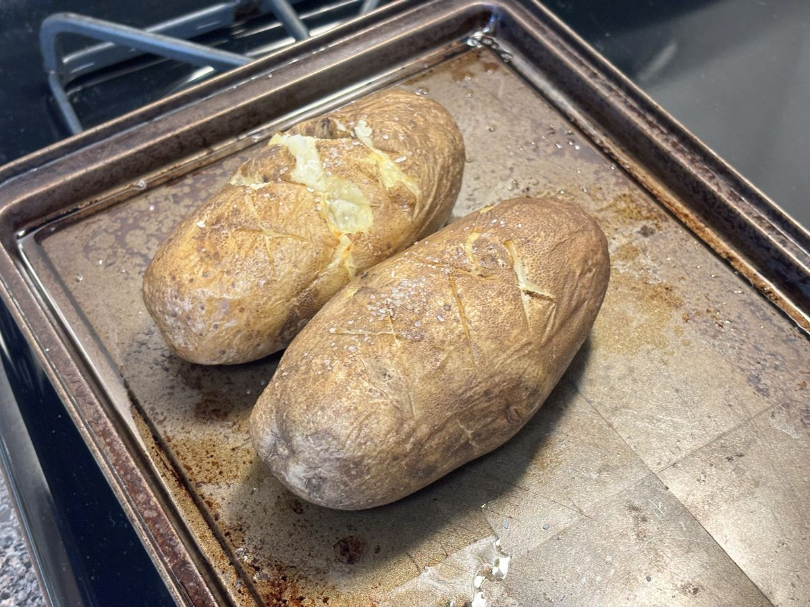

# Baked Potatoes

> Based on this [Oven-Baked Recipe](https://www.tastesoflizzyt.com/oven-baked-potatoes) and this [Instant Pot one](https://amindfullmom.com/instant-pot-baked-potatoes)

<!-- {cts} rating=5; (User can specify rating on scale of 1-5) -->

Personal rating: :fontawesome-solid-star: :fontawesome-solid-star: :fontawesome-solid-star: :fontawesome-solid-star: :fontawesome-solid-star:

<!-- {cte} -->

<!-- {cts} name_image=baked_potatoes.jpeg; (User can specify image name) -->

{: .image-recipe loading=lazy }

<!-- {cte} -->

## Ingredients

- [ ] 2-4 Russet Potatoes, scrubbed clean
- [ ] olive oil
- [ ] 1 tsp salt
- [ ] Grated cheese, black pepper, sour cream, chives, parsley, etc. for serving

## Recipe

### Oven

- Preheat the oven to 450F
- Scrub, wash, and dry the potatoes
- Poke each with a fork to allow steam to escape
- Rub oil and salt over the potatoes
- Bake on a baking sheet for 1.5-2 hours or until tender inside (45 minutes for smaller potatoes)
- Top with cheese, black pepper, and sour cream

### Instant Pot

In a pinch, use an Instant Pot to soften the potatoes, then crisp in the oven

- Scrub, wash, and dry the potatoes
- Insert the steamer rack into the instant pot, add 1 cup of (cold) water, then add the potatoes. Make sure the potatoes and water do not touch
- Seal and cook on high pressure for 20 min and quick release
    - For smaller potatoes, use 15 min
    - Start pre-heating the oven for 400F
- Place the potatoes in the oven at 400F for 8 min
    - The potatoes can either be quartered or cooked whole
- Top with cheese, black pepper, and sour cream
