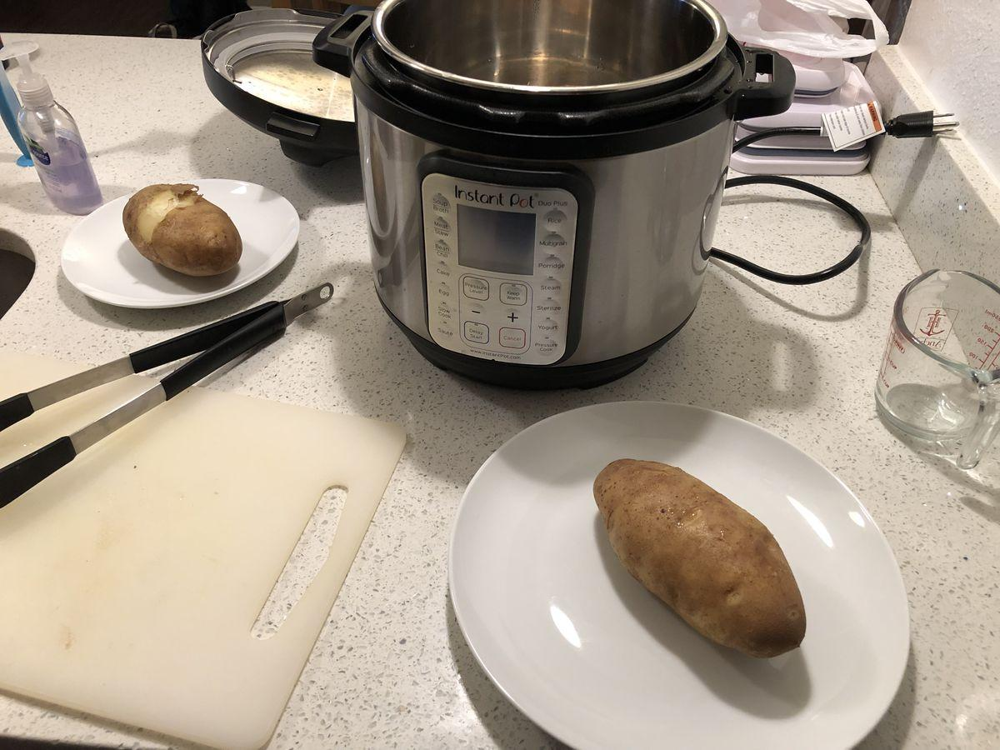

# Baked Potatoes (Instant Pot)

> Based on [https://amindfullmom.com/instant-pot-baked-potatoes/](https://amindfullmom.com/instant-pot-baked-potatoes/)

<!-- {cts} rating=1; (User can specify rating on scale of 1-5) -->

Personal rating: :fontawesome-solid-star: :fontawesome-regular-star: :fontawesome-regular-star: :fontawesome-regular-star: :fontawesome-regular-star:

<!-- {cte} -->

<!-- {cts} name_image=baked_potatoes_instant_pot.jpg; (User can specify image name) -->

{: .image-recipe loading=lazy }

<!-- {cte} -->

## Ingredients

- [ ] 2-4 Russet Potatoes, scrubbed clean
- [ ] olive oil
- [ ] 1 tbsp salt
- [ ] Instant Pot

## Recipe

- Scrub the potatoes clean.
- Insert the steamer rack into the instant pot, add 1 cup of (cold) water, then add the potatoes. Make sure the potatoes and water do not touch
- Close lid and turn the sealing vent to 'sealed.' Then use manual mode with high pressure for 20 minutes. Allow for natural release (~5 minutes)
- The potatoes can be quartered or cooked whole. For a crispy skin place in the oven at 400℉ for 8 minutes. Serve with whatever toppings you prefer.

## Notes

- For smaller potatoes, use 15 minutes
