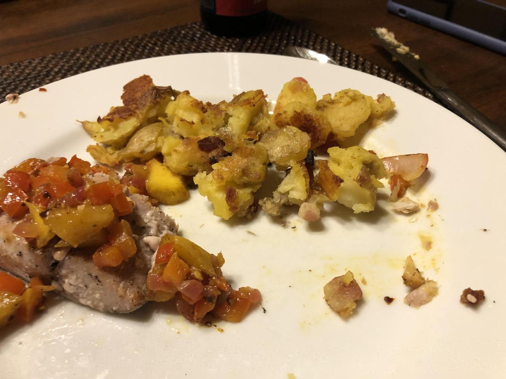

# Roasted Potatoes (Emily English)

> Based on [https://barefootcontessa.com/recipes/emilys-english-roasted-potatoes](https://barefootcontessa.com/recipes/emilys-english-roasted-potatoes)

<!-- {cts} rating=4; (User can specify rating on scale of 1-5) -->

Personal rating: :fontawesome-solid-star: :fontawesome-solid-star: :fontawesome-solid-star: :fontawesome-solid-star: :fontawesome-regular-star:

<!-- {cte} -->

<!-- {cts} name_image=roasted_potatoes_emily_english.jpeg; (User can specify image name) -->

{: .image-recipe loading=lazy }

<!-- {cte} -->

## Ingredients

- [ ] 3 pounds large Yukon Gold potatoes, peeled and 1.5 to 2-inch diced
- [ ] 1/2 cup vegetable oil
- [ ] Coarse sea salt
- [ ] Minced parsley

## Recipe

- Preheat the oven to 425F
- Bring a large pot of water with 2 tablespoons kosher salt to a boil
    - Add the potatoes, return to a boil, lower the heat, and simmer for 8 min
    - Drain the potatoes, place them back in the pot with the lid on, and shake the pot roughly for 5 seconds to rough up the edges
    - Carefully transfer the potatoes in one layer to a baking rack set over a sheet pan
    - Let cool, then dry with a towel or let sit for at least 15 min
- Pour the oil onto another sheet pan, tilt the pan to distribute the oil, and place the pan in the oven for 5 to 7 minutes, until the oil is smoking hot
    - Transfer the potatoes carefully into the oil (I use a large metal spatula) and toss them lightly to coat each potato with the hot oil. Lower the oven temperature to 350 degrees F. Roast for 45 minutes to one hour, turning the potatoes occasionally with tongs, until very browned and crisp on the outside and tender and creamy inside
- Transfer to a serving platter, sprinkle generously with 1.5-2 teaspoons sea salt and parsley and serve hot
