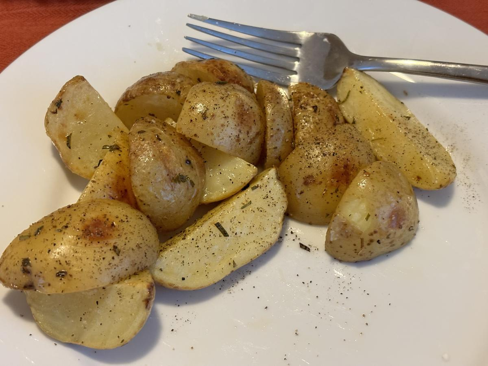

# Roasted Potatoes

> Based on [https://damndelicious.net/2015/08/12/lemon-rosemary-roasted-potatoes](https://damndelicious.net/2015/08/12/lemon-rosemary-roasted-potatoes)



Personal rating: :fontawesome-solid-star: :fontawesome-solid-star: :fontawesome-solid-star: :fontawesome-solid-star: :fontawesome-solid-star:

{}



{.image-recipe}

{}

## Ingredients

- [ ] 3 pounds red or yellow potatoes, halved or quartered until evenly sized (such as Yukon)
- [ ] 2 Tbsp olive oil
- [ ] 1 lemon, juice and zest
- [ ] 3 cloves garlic, minced
- [ ] 1 tsp dried rosemary
- [ ] Kosher salt and freshly ground black pepper, to taste
- [ ] (Optional) 2 Tbsp chopped parsley leaves
- [ ] (Optional) 2 sprigs fresh rosemary

## Recipe

- Preheat oven to 400F
- Lightly oil a baking sheet or coat with nonstick spray
- Place potatoes in a single layer onto the prepared baking sheet
- Add olive oil, lemon juice, garlic, and rosemary and season with salt and pepper. Gently toss to combine
- Place into oven and bake for 25-30 minutes, or until golden brown and crisp
- Serve immediately, garnished with lemon zest, parsley, and rosemary
