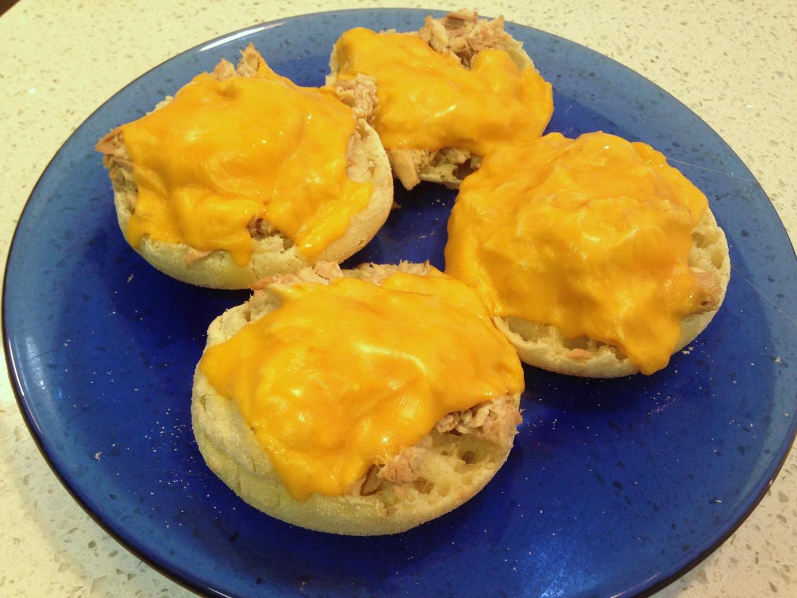

<!-- Needs Manual Review -->

# Tuna Melts

<!-- rating=1; (User can specify rating on scale of 1-5) -->
<!-- AUTO-UserRating -->
Personal rating: :fontawesome-solid-star: :fontawesome-solid-star: :fontawesome-solid-star: :fontawesome-solid-star: :fontawesome-regular-star: :fontawesome-regular-star: :fontawesome-regular-star: :fontawesome-regular-star:
<!-- /AUTO-UserRating -->

<!-- name_image=tuna_melts.jpg; (User can specify image name) -->
<!-- AUTO-Image -->
{: .image-recipe loading=lazy }
<!-- /AUTO-Image -->

## Ingredients

* [ ] 1 tbsp Mayonnaise
* [ ] 2 cans of Tuna
* [ ] 4-5 English Muffins
* [ ] 1 pickle
* [ ] Your Choice of Cheese slices

## Recipe

* Preheat oven to Broil (~10 min)
* Chop pickle and mix ingredients together. Toast English muffins
* On a foil-lined pan, cover the muffins with the tuna, then a slice of cheese. Broil until the cheese has melted
