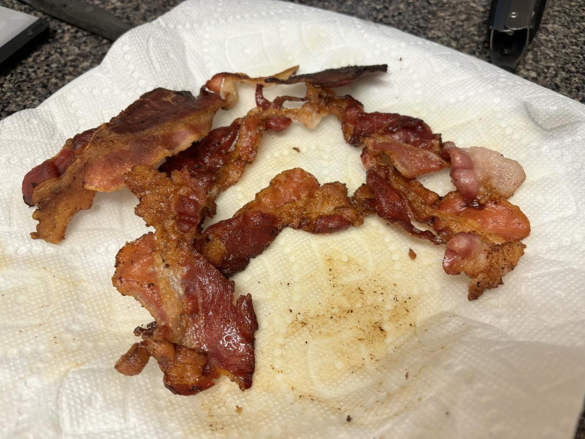

# Ultimate BLT

> Based on [https://www.cookwell.com/recipe/blt](https://www.cookwell.com/recipe/blt) and [https://fieldcompany.com/blogs/journal/how-to-cook-bacon-in-a-cast-iron-skillet](https://fieldcompany.com/blogs/journal/how-to-cook-bacon-in-a-cast-iron-skillet)

<!-- {cts} rating=5; (User can specify rating on scale of 1-5) -->

Personal rating: :fontawesome-solid-star: :fontawesome-solid-star: :fontawesome-solid-star: :fontawesome-solid-star: :fontawesome-solid-star:

<!-- {cte} -->

<!-- {cts} name_image=ultimate_blt.jpeg; (User can specify image name) -->

{: .image-recipe loading=lazy }

<!-- {cte} -->

## Ingredients

- [ ] 2 slices/sandwich bacon (look for no sugar added)
- [ ] Sandwich bread
- [ ] Tomato
- [ ] Romaine lettuce, thinly sliced
- [ ] Mayonnaise, spoonful
- [ ] Pickled Onions
- [ ] Vinegar, splash
- [ ] Salt and pepper

## Recipe

- Bacon
    - Place 4-5 slices on an unheated skillet
    - Heat on medium high until brown on one side (~5 min)
    - Flip with tongs and cook until crispy (4-6 min)
    - Place on a plate with a paper towel
- Slice the tomato into 1/2" thick pieces. Sprinkle with salt and pepper and let sit for 10 min
- Finely slice the lettuce
- Toast the bread, add mayo, lettuce, pickled onions, splash of vinegar, bacon, and tomatoes
