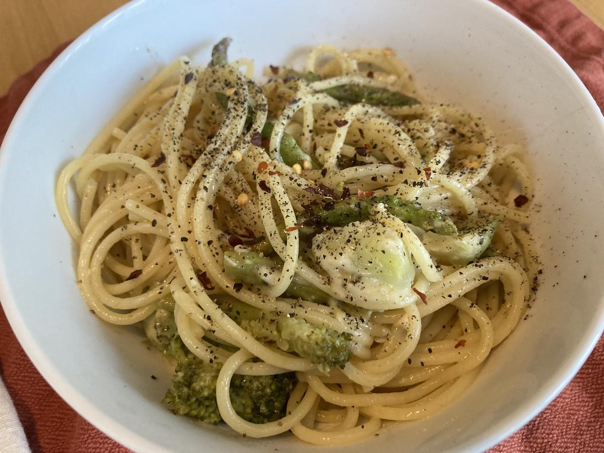

# Asparagus Pasta

> Based on [https://www.thekitchn.com/asparagus-pasta-recipe-23481318#post-recipe-446990087](https://www.thekitchn.com/asparagus-pasta-recipe-23481318#post-recipe-446990087)

<!-- {cts} rating=4; (User can specify rating on scale of 1-5) -->

Personal rating: :fontawesome-solid-star: :fontawesome-solid-star: :fontawesome-solid-star: :fontawesome-solid-star: :fontawesome-regular-star:

<!-- {cte} -->

<!-- {cts} name_image=asparagus_pasta.jpeg; (User can specify image name) -->

{.image-recipe}

<!-- {cte} -->

## Ingredients

- [ ] 1 lb asparagus, preferably thin
- [ ] 4 cloves garlic
- [ ] 1 medium lemon
- [ ] 1 ounce Parmesan cheese (1/2 cup firmly packed freshly grated or 1/3 cup store-bought grated), plus more for serving
- [ ] 1 lb dried spaghetti or other long pasta, such as linguine or bucatini
- [ ] 4 Tbsp olive oil, divided
- [ ] 1.5 tsp kosher salt, divided
- [ ] 1/4 tsp freshly ground black pepper
- [ ] 1/4 tsp red pepper flakes (optional)
- [ ] Fresh basil leaves, for serving (optional)

## Recipe

- Bring a large pot of salted water to a boil. Trim 1 lb asparagus and cut crosswise on a slight diagonal into 1.5-inch pieces (about 3 cups). Mince 4 garlic cloves. Finely grate the zest of 1 medium lemon (about 1 tablespoon). Juice the lemon until you have 3 Tbsp. Finely grate 1 ounce Parmesan cheese (about 1/2 packed cup) or measure out 1/3 cup store-bought grated.
- Add 1 lb dried pasta to the boiling water and cook 1 minute less than al dente, about 9 minutes or according to package instructions. Meanwhile, cook the asparagus.
- Heat 3 Tbsp of the olive oil in a large skillet over medium heat until shimmering. Add the asparagus, 1 tsp of the kosher salt, 1/4 tsp black pepper, and 1/4 tsp red pepper flakes if using. Sauté until the asparagus is bright green and crisp-tender, 3 to 4 minutes. Add the garlic and sauté until fragrant, about 1 minute. Remove from heat and stir in the lemon zest and lemon juice.
- Reserve 1 cup of the pasta water, then drain the pasta. Return the skillet to medium heat and add the pasta, remaining 1/2 tsp kosher salt, and reserved pasta water. Cook, tossing and stirring the pasta, until the pasta is al dente and almost all of the pasta water is absorbed, 1 to 2 minutes.
- Remove the pan from the heat. Add the Parmesan and remaining 1 tablespoon olive oil, and toss to combine. Serve garnished with more grated Parmesan and torn fresh basil leaves if desired.
