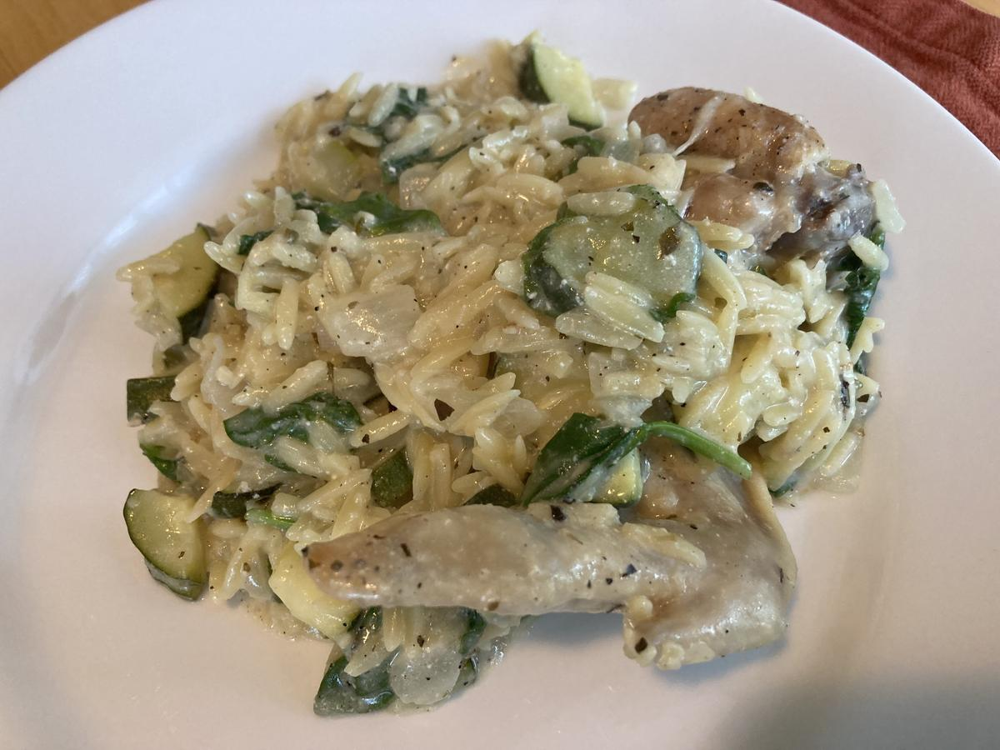

# Creamy Orzo Chicken Skillet

> Based on [https://www.thekitchn.com/creamy-orzo-chicken-skillet-recipe-23554753#post-recipe-545970017](https://www.thekitchn.com/creamy-orzo-chicken-skillet-recipe-23554753#post-recipe-545970017)

<!-- {cts} rating=0; (User can specify rating on scale of 1-5) -->

Personal rating: *Not yet rated*

<!-- {cte} -->

<!-- {cts} name_image=creamy-orzo-chicken-skillet.jpeg; (User can specify image name) -->

{: .image-recipe loading=lazy }

<!-- {cte} -->

## Ingredients

- [ ] 1 large shallot or 1/2 small yellow onion
- [ ] 2 cloves garlic
- [ ] 1 pound zucchini (2 medium)
- [ ] 1 medium lemon
- [ ] 1 ounce Parmesan cheese (1/2 cup firmly packed freshly grated or 1/3 cup store-bought grated)
- [ ] 1 1/2 pounds boneless, skinless chicken thighs (5 to 6)
- [ ] 2 teaspoons kosher salt, divided
- [ ] 1/4 teaspoon freshly ground black pepper
- [ ] 3 tablespoons olive oil, divided
- [ ] 10 ounces dried orzo pasta (about 1 1/2 cups)
- [ ] 2 cups low-sodium chicken broth
- [ ] 2 cups whole milk (can substitute for equal parts ricotta)
- [ ] Spinach, carrots, or peas

Make sure to use boneless, skinless thighs...and use a large pot!

## Recipe

- Thinly slice 1 large shallot or 1/2 small yellow onion (about 1/2 cup). Mince 2 garlic cloves. Trim 1 pound zucchini, halve lengthwise (quarter lengthwise if wider than 1 1/2-inches), then cut crosswise into 1/4-inch-wide pieces (about 3 1/2 cups). Finely grate the zest of 1 medium lemon (about 1 loosely packed tablespoon). Juice the lemon until you have 2 tablespoons. Finely grate 1 ounce Parmesan cheese (about 1/2 cup lightly packed) if needed, or measure out 1/3 cup store-bought.
- Pat 1 1/2 pounds boneless, chicken thighs dry with paper towels. Season all over with 1/2 teaspoon of the kosher salt and 1/4 teaspoon black pepper.
- Heat 1 tablespoon of the olive oil in a 12-inch or larger high-sided skillet or Dutch oven over medium-high heat until shimmering. Add the chicken and sear until browned on the bottom, 5 to 6 minutes. Flip with tongs and seared until the second side is browned, 2 to 3 minutes more. Transfer to a plate. The chicken will not be cooked through yet.
- Add the remaining 2 tablespoons olive oil, shallot, and zucchini to the skillet. Cook, stirring occasionally, until softened, about 3 minutes. Add 10 ounces dried orzo, garlic, and lemon zest, and stir to coat with the oil. Cook until lightly toasted and fragrant, 1 to 2 minutes.
- Add 2 cups low-sodium chicken broth, 2 cups whole milk, and the remaining 1 1/2 teaspoons kosher salt. Stir to combine, scraping up any browned bits from the bottom of the pan with a wooden spoon.
- Bring to a boil over medium-high heat, stirring frequently to keep the orzo from sticking. Reduce the heat to maintain a simmer. Nestle the chicken into the orzo and pour in any accumulated juices. Cook uncovered, making sure the orzo is in the liquid at all times and stirring frequently, until the orzo is tender, the chicken is cooked through and registers at least 165ºF on an instant-read thermometer, and most of the liquid is absorbed, 10 to 12 minutes.
- Remove the pan from the heat. Add the lemon juice and Parmesan and stir to combine. Taste and season with more kosher salt if needed. Let sit for 5 minutes before serving.
