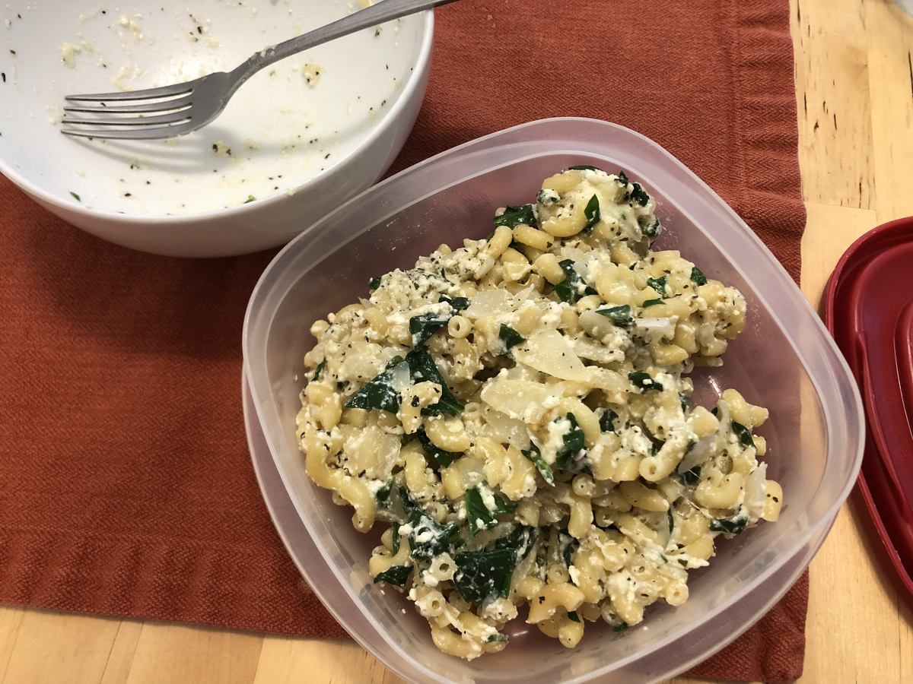

# Leftover Ricotta Pasta

> Primarily based on [https://www.today.com/recipes/one-pot-pasta-spinach-ricotta-recipe-t163679](https://www.today.com/recipes/one-pot-pasta-spinach-ricotta-recipe-t163679) and recommended mixins from [https://www.thespruceeats.com/spinach-and-ricotta-pasta-2246391](https://www.thespruceeats.com/spinach-and-ricotta-pasta-2246391)

<!-- {cts} rating=3; (User can specify rating on scale of 1-5) -->

Personal rating: :fontawesome-solid-star: :fontawesome-solid-star: :fontawesome-solid-star: :fontawesome-solid-star: :fontawesome-solid-star: :fontawesome-solid-star: :fontawesome-regular-star: :fontawesome-regular-star:

<!-- {cte} -->

<!-- {cts} name_image=leftover_ricotta_pasta.jpg; (User can specify image name) -->

{: .image-recipe loading=lazy }

<!-- {cte} -->

## Ingredients

* [ ] 2-3 tbsp (1/2 stick) butter
* [ ] 1 small onion or large shallot, chopped
* [ ] 1 clove garlic
* [ ] 1 lb any pasta (~1 cup elbow macaroni), uncooked
* [ ] Salt and pepper
* [ ] 1/2 cup water, multiple
* [ ] 3 cups chopped spinach
* [ ] 1 cup ricotta cheese
* [ ] 1 tbsp lemon juice
* [ ] 1 tsp basil
* [ ] 1/2 cup grated Parmesan cheese, plus more for serving

## Recipe

* Put 2 tbsp of the butter in a large skillet over medium heat. When hot, add the onion and garlic, stirring occasionally, until softened (~3 min)
* Set at timer for a max of 15 minutes
    * Add the pasta and raise to medium-high, stirring constantly, until  glossy and smells toasty (~1 min)
    * Add a 1/2 cup water and a little salt and pepper
    * Let the liquid bubble away, then repeat adding 1/2 cup of water, stirring, then when absorbed, add more. Keep the heat at medium to medium-high, stir frequently
    * After 10 min, begin tasting until al dente
* Add the spinach, lemon, basil, and ricotta
* When the spinach softens, stir in the Parmesan. Add a little more water if necessary to coat the noodles in sauce
* Taste and serve immediately

## Notes

* This is a nice way to use up leftover ricotta cheese!
* I tossed in mozzarella cheese instead of parmesan, since we had some leftover from baked ziti
