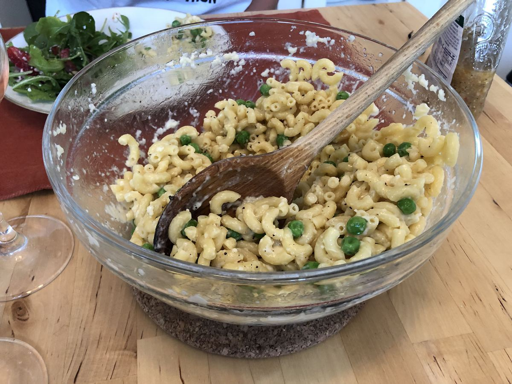

<!-- Do not modify sections with "AUTO-*". They are updated by make.py -->

# Microwave Cacio E Pepe

> Based on [https://www.amazon.com/Vegetables-Unleashed-Cookbook-Jose-Andres/dp/0062668382/](https://www.amazon.com/Vegetables-Unleashed-Cookbook-Jose-Andres/dp/0062668382/)

<!-- rating=3; (User can specify rating on scale of 1-5) -->
<!-- AUTO-UserRating -->
Personal rating: :fontawesome-solid-star: :fontawesome-solid-star: :fontawesome-solid-star: :fontawesome-solid-star: :fontawesome-solid-star: :fontawesome-solid-star: :fontawesome-regular-star: :fontawesome-regular-star:
<!-- /AUTO-UserRating -->

<!-- name_image=microwave_cacio_e_pepe.jpeg; (User can specify image name if multiple exist) -->
<!-- AUTO-Image -->
{: .image-recipe loading=lazy }
<!-- /AUTO-Image -->

## Ingredients

* [ ] 2 cup elbow macaroni
* [ ] 6 cups water
* [ ] 1 tsp kosher salt
* [ ] 1 cup frozen corn kernels, frozen peas, or fresh peas
* [ ] 4 tbsp butter
* [ ] 1 cup grated Pecorino Romano or Parmigiano-Reggiano
* [ ] Ground pepper

## Recipe

* Combine pasta and water in a microwaveable bowl, add a pinch of salt, and microwave on high for 5 min
* Stir in the peas and return for 1 more minute
* Working quickly, pour off most of the water until a few tbsp remain
* Vigorously stir in butter and cheese. Caution to not stir too much or the cheese can ball up and not be evenly distributed
* Serve with fresh ground pepper

## Notes

* Vegetables Unleashed Jose Andreas, pg. 102
* Note recipe is doubled. Can also be made by boiling pasta and adding the ingredients after
