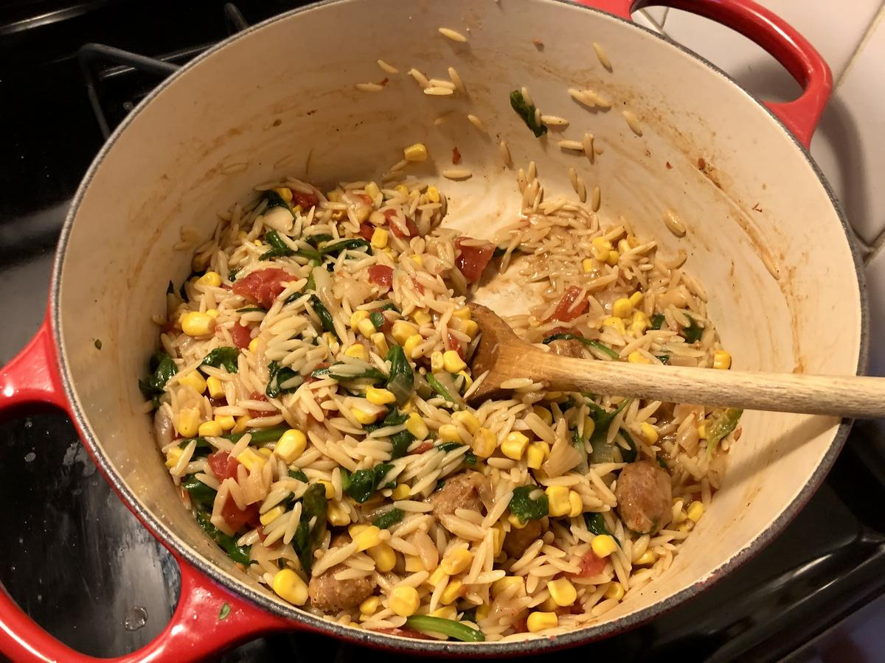

# One-Pot Orzo with Sausage, Spinach, and Corn

> Based on [https://www.skinnytaste.com/one-pot-orzo-with-sausage-spinach-and-corn/#recipe](https://www.skinnytaste.com/one-pot-orzo-with-sausage-spinach-and-corn/#recipe)

<!-- {cts} rating=4; (User can specify rating on scale of 1-5) -->

Personal rating: :fontawesome-solid-star: :fontawesome-solid-star: :fontawesome-solid-star: :fontawesome-solid-star: :fontawesome-solid-star: :fontawesome-solid-star: :fontawesome-solid-star: :fontawesome-regular-star:

<!-- {cte} -->

<!-- {cts} name_image=one_pot_orzo_with_sausage_spinach_and_corn.jpeg; (User can specify image name) -->

{: .image-recipe loading=lazy }

<!-- {cte} -->

## Ingredients

- [ ] 14 ounces sausage
- [ ] 1/2 medium yellow onion, chopped
- [ ] 1 can corn
- [ ] 1 can diced tomatoes
- [ ] 1 cup dry orzo
- [ ] 3 cups low sodium chicken broth
- [ ] 3 cups packed baby spinach
- [ ] 1/4 cup freshly grated parmesan
- [ ] black pepper
- [ ] Optionally add Garlic, Thyme, Italian, etc.

## Recipe

- Remove the sausage from the casing and cook in a Dutch oven for 5 minutes on medium-high heat
- Add the onion, corn, and tomatoes and saute for 10 minutes
- Add the orzo and chicken broth, stir to combine then bring to a boil
- Reduce heat to medium-low and simmer 10 minutes; stir and scrape the bottom a few times to keep orzo from sticking
- Remove from the heat, add the spinach, stir and cover for a couple minutes, until the spinach has wilted
- Top with freshly grated parmesan and black pepper

## Notes

- Related to the [Broccoli Cheddar Chicken and Rice Casserole](../meals/broccoli_cheddar_chicken_and_rice_casserole.md)
