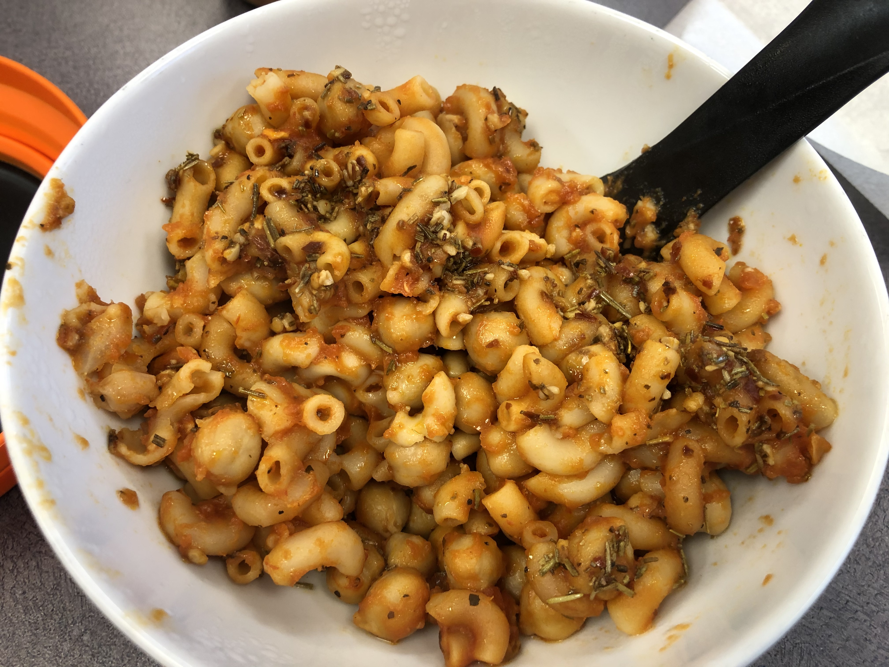

<!-- Needs Manual Review -->

# Pasta And Chickpeas

> Based on [https://smittenkitchen.com/2017/10/quick-pasta-and-chickpeas-pasta-e-ceci/](https://smittenkitchen.com/2017/10/quick-pasta-and-chickpeas-pasta-e-ceci/)

<!-- {cts} rating=2; (User can specify rating on scale of 1-5) -->
Personal rating: :fontawesome-solid-star: :fontawesome-solid-star: :fontawesome-solid-star: :fontawesome-solid-star: :fontawesome-solid-star: :fontawesome-regular-star: :fontawesome-regular-star: :fontawesome-regular-star:
<!-- {cte} -->

<!-- {cts} name_image=pasta_and_chickpeas.jpeg; (User can specify image name) -->
{: .image-recipe loading=lazy }
<!-- {cte} -->

## Ingredients

* [ ] Ingredients
    * [ ] 2 tbsp olive oil
    * [ ] 2 cloves garlic, peeled and smashed
    * [ ] 3 tbsp tomato paste*
    * [ ] 1 tsp kosher salt
    * [ ] black pepper
    * [ ] 1 can (15-ounce) chickpeas, drained and rinsed
    * [ ] 1/2 cup uncooked ditalini or annelini pasta (or in a pinch, macaroni)
    * [ ] 2 cups boiling water*
* [ ] Toppings
    * [ ] 2 tbsp olive oil
    * [ ] 1 clove of garlic, peeled and finely chopped
    * [ ] 1/3 tsp rosemary
    * [ ] pinch of salt
    * [ ] 1 tsp red pepper flakes

## Recipe

* Prep ingredients
* Start boiling the water
* In a med-lg pot, heat oil until simmering. Add garlic and cook until fragrant. Stir in tomato paste or sauce, salt, and pepper. Cook for ~1 minute
* Add the chickpeas, pasta, boiling water
* Lower the heat and simmer for 15-20 minutes until most of the liquid is absorbed
* For the finishing, in a small pan, heat oil over med-low heat with garlic, rosemary, salt, and red pepper flakes until sizzling. Drizzle!

## Notes

* *Replace the 3 tbsp of tomato paste with 9 tbsp of pasta sauce. Reduce the boiling water to 1 cup instead of 2
