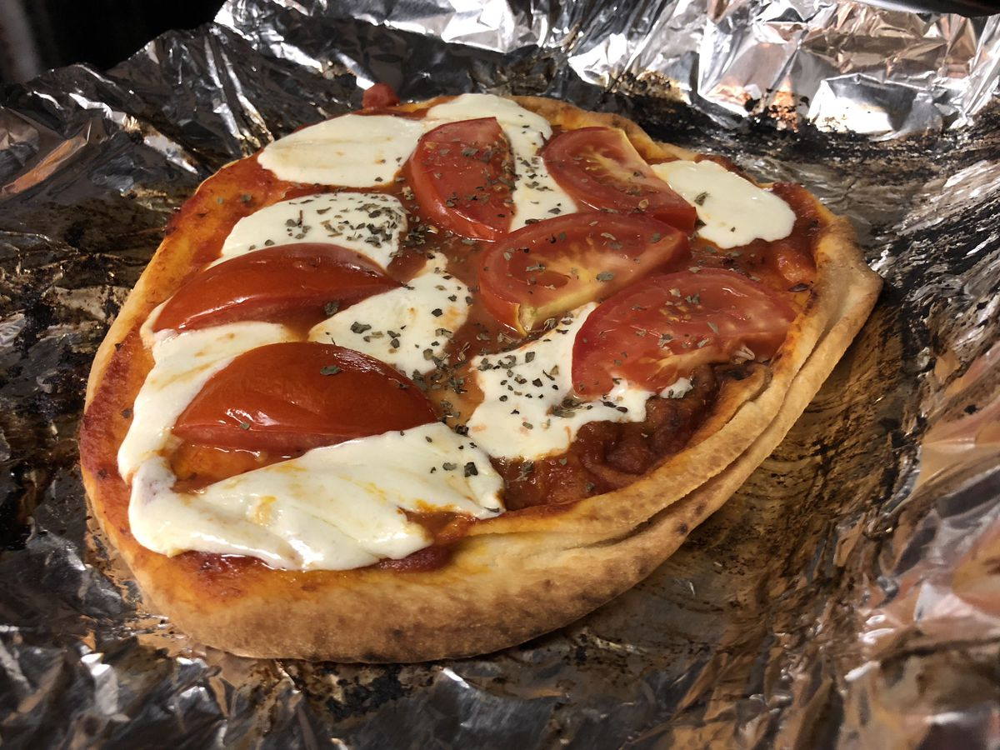

<!-- Do not modify. Auto-generated with mkdocs_migrate.py -->

# Naan Pizza

<!-- rating=1; (User can specify rating on scale of 1-5) -->
<!-- AUTO-UserRating -->
Personal rating: :fontawesome-solid-star: :fontawesome-regular-star: :fontawesome-regular-star: :fontawesome-regular-star: :fontawesome-regular-star:
<!-- /AUTO-UserRating -->

<!-- AUTO-Image -->
{: .image-recipe loading=lazy }
<!-- /AUTO-Image -->

## Ingredients

* [ ] 2 naan
* [ ] olive oil
* [ ] pasta sauce
* [ ] red pepper flakes
* [ ] 1/2 ball mozzarella, sliced into chunks
* [ ] 1 tomato, sliced
* [ ] fresh basil

## Recipe

* Preheat oven to 425 and place a shelf on the top rack. Cover a baking sheet in tin foil
* Prep the naan pizza and place in the oven for 12-16 minutes
* Plenty of options to mix this up. This just happened to be leftovers from other meals

## Notes

* Can also be made with grape tomatoes
* Add the red pepper flakes to the sauce before baking
* Optionally, add olive oil to the naan before the pasta sauce and/or garlic
