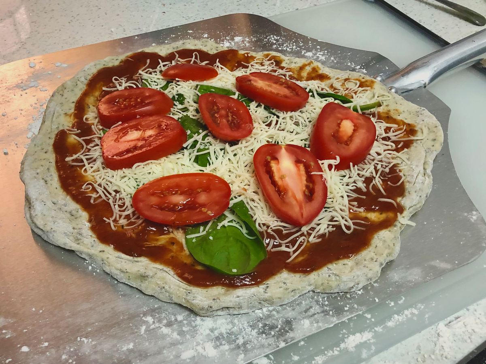

<!-- Do not modify sections with "AUTO-*". They are updated by make.py -->

# Pizza

> Based on [https://www.washingtonpost.com/graphics/2019/voraciously/how-to-make-pizza/?wpisrc=nl_vplantpowered_w2&wpmm=1](https://www.washingtonpost.com/graphics/2019/voraciously/how-to-make-pizza/?wpisrc=nl_vplantpowered_w2&wpmm=1)

<!-- rating=2; (User can specify rating on scale of 1-5) -->
<!-- AUTO-UserRating -->
Personal rating: :fontawesome-solid-star: :fontawesome-solid-star: :fontawesome-regular-star: :fontawesome-regular-star: :fontawesome-regular-star:
<!-- /AUTO-UserRating -->

<!-- AUTO-Image -->
{: .image-recipe loading=lazy }
<!-- /AUTO-Image -->

## Ingredients

* [ ] bag of pre-kneaded dough (Trader Joe's is best)
* [ ] marinara sauce
* [ ] mozzarella cheese
* [ ] (optional) Parmesan cheese, feta
* [ ] (optional) spinach, peppers, tomatoes, canned fire-roasted tomatoes, etc.
* [ ] (optional) chicken, sausage, pepperoni, etc.
* [ ] (optional) red pepper flakes, basil
* [ ] flour

## Recipe

* Let the dough rest at room temperature for at least 2-3 hours to come to room temperature. Best if covered in a bowl, but fine to leave in the plastic bag from the grocery
* Put the cold pizza stone in a cold oven then preheat to 425
* Place the dough on a lightly floured surface, then gently press to form a larger circle. Avoid pressing on the middle and crust
* Once you have an 8-inch round, pick up the dough and gently drape it over the knuckles on both of your hands. Slowly rotate it, allowing gravity to stretch it into a round about 11 inches in diameter. If the dough starts to resist stretching, put it down and allow it to rest for a few minutes, at which point it should stretch more easily
* Can also be stretch by passing between your hands or by pulling when flat. See link
* Put a thin layer of flour on the pizza peel. Quickly add the toppings to prevent the dough from absorbing the flour and sticking. Additionally, regularly shake the peel to make sure the pizza slides around easily
* Add a thin layer of sauce (less than you think). Hold off on the rest of the toppings for now (maybe ~3 spoon fulls)
* With a jittery back and forth motion, slide the pizza onto the stone
* Bake for 6-8 min, then remove from the oven with the pizza peel
* Add the cheese and other toppings and return to the pizza stone for another 5-10 min
* Finally remove and transfer to a large cutting board to slice
* Wash the peel with soap and water. See the Tools/Pizza Stone section for stone care

## Notes

* If using a baking sheet, cook for 22 minutes at 425F
* See video for how to stretch out the dough: https://www.youtube.com/watch?time_continue=33&v=9f9-xTcKzZo
