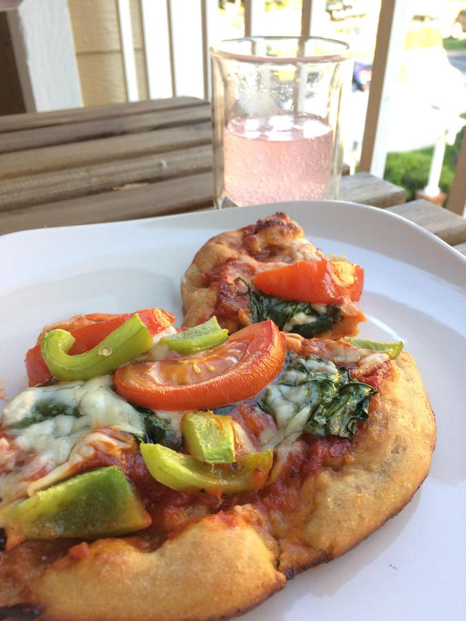

# Pizza

> Based on [https://www.washingtonpost.com/graphics/2019/voraciously/how-to-make-pizza/?wpisrc=nl_vplantpowered_w2&wpmm=1](https://www.washingtonpost.com/graphics/2019/voraciously/how-to-make-pizza/?wpisrc=nl_vplantpowered_w2&wpmm=1)

<!-- {cts} rating=4; (User can specify rating on scale of 1-5) -->

Personal rating: :fontawesome-solid-star: :fontawesome-solid-star: :fontawesome-solid-star: :fontawesome-solid-star: :fontawesome-solid-star: :fontawesome-solid-star: :fontawesome-solid-star: :fontawesome-regular-star:

<!-- {cte} -->

<!-- {cts} name_image=pizza.jpg; (User can specify image name) -->

{: .image-recipe loading=lazy }

<!-- {cte} -->

## Ingredients

- [ ] Bag of pre-kneaded dough (Trader Joe's is best)
- [ ] Flour for prep
- [ ] Marinara sauce
- [ ] Mozzarella cheese
- [ ] (Optional) Parmesan cheese, feta
- [ ] (Optional) spinach, peppers, tomatoes, canned fire-roasted tomatoes, etc.
- [ ] (Optional) chicken, sausage, pepperoni, etc.
- [ ] (Optional) red pepper flakes, basil

## Recipe

- Let the dough rest at room temperature for at least 3-4 hours to come to room temperature
- Put the cold pizza steel in a cold oven. Heat to 450 and keep warm for an hour to properly heat the pizza steel
- Prep a lightly floured surface. Stretch the dough by hand, then roll until very thin with a rolling pin
- Put a thin layer of flour on the pizza peel and transfer the dough onto the peel
    - Spread a (very) thin layer of sauce (2-3 spoons) and quickly add the toppings
    - To prevent sticking, intermittently shake the peel to make sure the pizza slides around easily
- With a jittery back and forth motion, slide the pizza onto the steel
- Bake for **TBD** min (maybe 10-25 min), then remove from the oven with the pizza peel and transfer to a large cutting board to slice
- Wash the peel with soap and water. See the Tools section for care of the Pizza Steel (or Stone)

## Notes

- Best if covered in a bowl, but fine to leave in the plastic bag from the grocery
- For the temperature range of a home oven, steel is better than stone
- We have never had any luck with getting the dough thin enough without a rolling pin, but the below methods should also work
    - Stretch out the dough on a lightly floured surface. Stretch from the center outwards
        - Once you have an 8-inch round, pick up the dough and gently drape it over the knuckles on both of your hands. Slowly rotate it, allowing gravity to stretch it into a round about 11 inches in diameter. If the dough starts to resist stretching, put it down and allow it to rest for a few minutes, at which point it should stretch more easily
        - Can also be stretch by passing between your hands or by pulling when flat. [See video for how to stretch out the dough](https://www.youtube.com/watch?time_continue=33&v=9f9-xTcKzZo)
