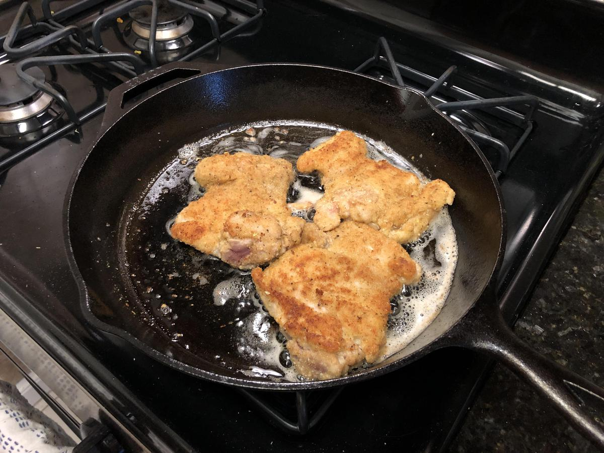

<!-- Do not modify sections with "AUTO-*". They are updated by make.py -->

# Breaded Chicken

> Based on [https://www.youtube.com/watch?v=dYOpvMt5498](https://www.youtube.com/watch?v=dYOpvMt5498)

<!-- rating=2; (User can specify rating on scale of 1-5) -->
<!-- AUTO-UserRating -->
Personal rating: :fontawesome-solid-star: :fontawesome-solid-star: :fontawesome-solid-star: :fontawesome-solid-star: :fontawesome-solid-star: :fontawesome-regular-star: :fontawesome-regular-star: :fontawesome-regular-star:
<!-- /AUTO-UserRating -->

<!-- name_image=breaded_chicken.jpeg; (User can specify image name if multiple exist) -->
<!-- AUTO-Image -->
{: .image-recipe loading=lazy }
<!-- /AUTO-Image -->

## Ingredients

* [ ] Eggs
* [ ] Salt and Pepper
* [ ] Bread Crumbs
* [ ] Flour

## Recipe

* If not already in cutlets, cut in half until thin and pound. Put the chicken in a gallon bag and use an empty wine bottle or rolling pin to flatten out the chicken so that it will cook quickly and evenly
* With a fork, beat 2 tbsp water, 2 eggs, 1/4 tsp salt, and 1/4 pepper in a regular bowl
* Pull out two plates. on the left, spread a layer of flour and on the right spread a layer of bread crumbs
* To the bread crumbs, add 1/4 tsp salt, 1/4 tsp pepper, crush dried oregano (~1 tsp?), and crush dried thyme leaves. Mix
* To the flour, add a little salt and pepper. Mix
* Heat up some oil on a skillet under medium heat
* Working with your left hand coat the chicken in the flour. Dip into egg, letting excess drip off. Then coat with bread crumbs
* Place on the hot skillet and cook until golden brown on both side and cooked thoroughly

## Notes

* Kind of waited a few months to write this down... so probably review the source video if making
