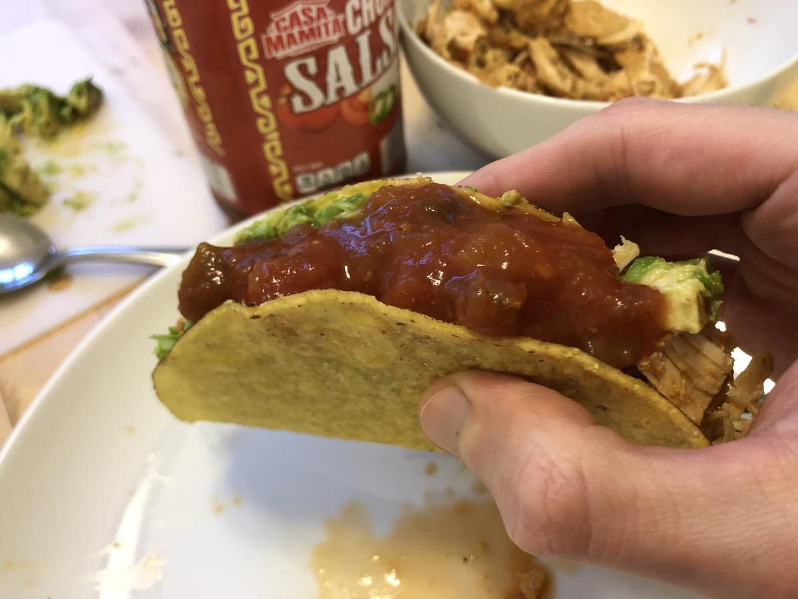

# Chicken Tacos

> Based on [https://www.lecremedelacrumb.com/instant-pot-shredded-chicken-tacos/](https://www.lecremedelacrumb.com/instant-pot-shredded-chicken-tacos/) and [https://www.thekitchn.com/instant-pot-chicken-tacos-recipe-23153067](https://www.thekitchn.com/instant-pot-chicken-tacos-recipe-23153067) and [https://www.thereciperebel.com/instant-pot-chicken-breast/](https://www.thereciperebel.com/instant-pot-chicken-breast/)

<!-- {cts} rating=4; (User can specify rating on scale of 1-5) -->

Personal rating: :fontawesome-solid-star: :fontawesome-solid-star: :fontawesome-solid-star: :fontawesome-solid-star: :fontawesome-regular-star:

<!-- {cte} -->

<!-- {cts} name_image=chicken_tacos.jpg; (User can specify image name) -->

{: .image-recipe loading=lazy }

<!-- {cte} -->

## Ingredients

### Taco Seasoning

> or use store bought seasoning

- [ ] 1 tsp salt
- [ ] 1 tsp ground cumin
- [ ] 1 tsp chili powder
- [ ] 1 tsp garlic powder
- [ ] 15-ounce can fire roasted tomatoes

### Tacos

- [ ] Instant Pot
- [ ] 1/2 cup water
- [ ] 2.5 lbs boneless skinless chicken (thighs, breast, etc.)
- [ ] 1/2 cup Salsa
- [ ] Taco Seasoning (above)

### Serving

- [ ] Corn or flour taco-size tortillas
- [ ] Shredded cheese (Cheddar, Monterrey Jack, or Mix)
- [ ] Shredded lettuce, cabbage, or baby spinach
- [ ] Tomatoes, diced
- [ ] Onions, diced
- [ ] Lime wedges
- [ ] Cilantro
- [ ] Salsa
- [ ] Hot Sauce
- [ ] Sour cream
- [ ] Avocado slices or Guacamole
- [ ] Sliced pickled or fresh jalapeños
- [ ] Thinly sliced radishes

## Recipe

- Place 1/2 cup of water in an instant pot. Add the chicken and coat with taco seasoning (store bought or DIY seasoning) and top with the 1/2 cup of salsa
    - Cook for 20-30 min (depending on size) at low heat and high pressure. Quick release and shred (pull apart) with 2 forks
- Serve on tacos, in a Quesadillas, or in a sandwich

### (Optional) Creamy Avocado Sauce Recipe

- [ ] Lime, juiced (2 Tbsp)
- [ ] Avocado, pitted and peeled
- [ ] 1/3 cup sour cream or plain Greek yogurt
- [ ] 1/2 tsp kosher salt

> Place the lime juice in a mini food processor. Add the avocado, sour cream, and salt. Process until smooth. Thin out with more lime juice if desired
