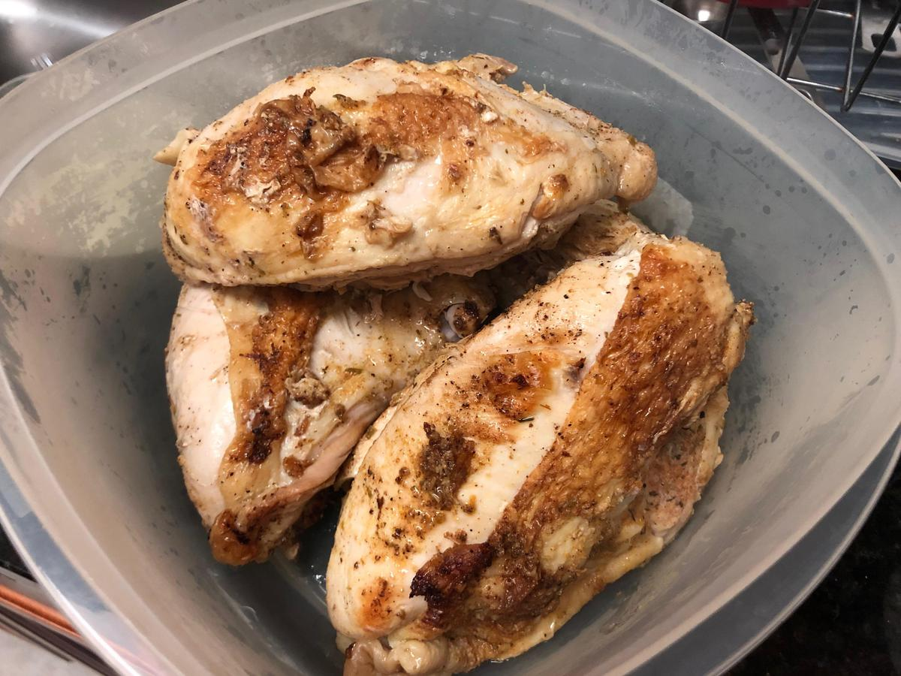

# Chicken Thighs

> Based on [https://kristineskitchenblog.com/instant-pot-chicken-thighs/](https://kristineskitchenblog.com/instant-pot-chicken-thighs/)

<!-- {cts} rating=1; (User can specify rating on scale of 1-5) -->

Personal rating: :fontawesome-solid-star: :fontawesome-solid-star: :fontawesome-solid-star: :fontawesome-solid-star: :fontawesome-regular-star: :fontawesome-regular-star: :fontawesome-regular-star: :fontawesome-regular-star:

<!-- {cte} -->

<!-- {cts} name_image=chicken_thighs.jpeg; (User can specify image name) -->

{: .image-recipe loading=lazy }

<!-- {cte} -->

## Ingredients

* [ ] 2 pounds chicken thighs (about 3-4 thighs)
* [ ] 1 tsp dried oregano
* [ ] 1 tsp paprika
* [ ] 1 tsp garlic powder
* [ ] 1/2 tsp onion powder
* [ ] 1/2 tsp coarse Kosher salt
* [ ] 1/4 tsp black pepper
* [ ] olive oil

## Recipe

* In a small bowl, combine the oregano, paprika, garlic powder, onion powder, salt, and pepper. Rub over thighs
* With small amount of olive oil, saute thighs in Instant Pot (on Saute setting). Cook 4 minutes per side
* Turn off the Instant Pot. Pour in 1 cup of water then use a spatula to scrape off any browned bits on the bottom of the pot
* Place the metal trivet in the Instant Pot and put chicken thighs on top. Seal release value and set to Pressure cook for 10 min (8 min if boneless). Allow natural release for 5 min
* Vent remaining pressure. Check that chicken reached 165F

## Notes

* To cook frozen chicken thighs, skip the step of browning as you cannot brown frozen meat. Place 1 cup of water, trivet, and the frozen chicken thighs in the Instant Pot. Cook for 15 min at high pressure plus 5 minutes natural pressure release
