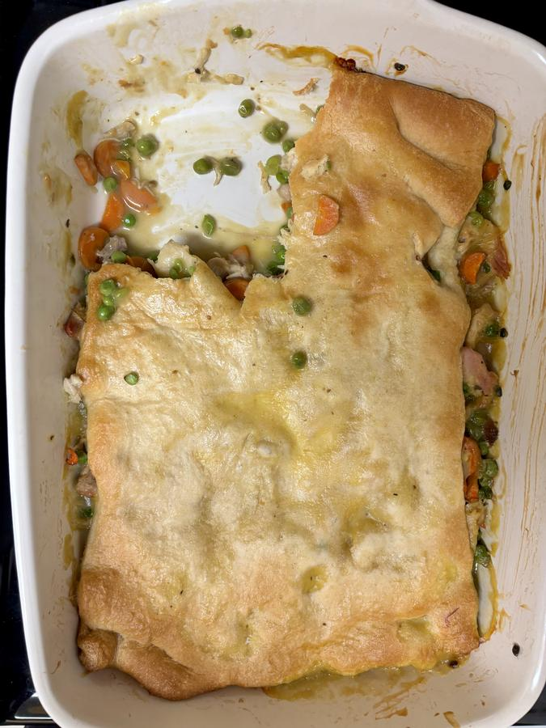

# Dump Chicken Pot Pie

> Based on [https://www.thekitchn.com/dump-chicken-pot-pie-recipe-23619963](https://www.thekitchn.com/dump-chicken-pot-pie-recipe-23619963)

<!-- {cts} rating=5; (User can specify rating on scale of 1-5) -->

Personal rating: :fontawesome-solid-star: :fontawesome-solid-star: :fontawesome-solid-star: :fontawesome-solid-star: :fontawesome-solid-star:

<!-- {cte} -->

<!-- {cts} name_image=dump_chicken_pot_pie.jpeg; (User can specify image name) -->

{: .image-recipe loading=lazy }

<!-- {cte} -->

## Ingredients

### Poached Chicken

- [ ] 4 boneless, skinless chicken thighs (1.5 - 2 lbs)
- [ ] Salt to taste
- [ ] 2 bay leaves

### Pot Pie

- [ ] Shredded Chicken, cooked (See [./poached_chicken.md](./poached_chicken.md))
- [ ] Bag of frozen peas
- [ ] 4-medium carrots, coined
- [ ] 1 10.5 oz can of *condensed* cream of chicken soup
- [ ] 1 10.5 oz can of *condensed* cream of mushroom soup
- [ ] 1x 8" tube of Crescent Roll Dough

## Recipe

- Arrange a rack in the middle of the oven and heat the oven to 375F
- In a 9x13 baking dish, add the shredded chicken, peas, carrots, and both cans of soup (reserve 1 tbsp of either)
- Gently stir to combine and spread into an even layer
- Carefully unroll 1 tube of crescent roll dough and lay over the filling (note: the dough doesn't need to reach the edges of the dish). Rub the reserved cream soup over the dough
- Bake until golden-brown and bubbling, about 30 min
    - If the dough has browned, but the filling isn't warmed, tent with aluminum foil
- Let cool for 5 to 10 minutes before serving
