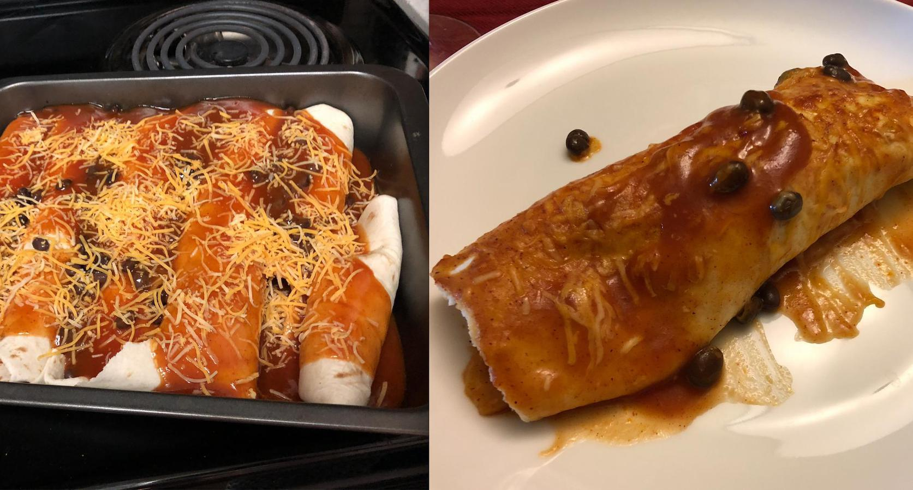

# Enchiladas

<!-- {cts} rating=5; (User can specify rating on scale of 1-5) -->

Personal rating: :fontawesome-solid-star: :fontawesome-solid-star: :fontawesome-solid-star: :fontawesome-solid-star: :fontawesome-solid-star: :fontawesome-solid-star: :fontawesome-solid-star: :fontawesome-solid-star:

<!-- {cte} -->

<!-- {cts} name_image=enchiladas.jpg; (User can specify image name) -->

{: .image-recipe loading=lazy }

<!-- {cte} -->

## Ingredients

### Core

- [ ] Rotisserie chicken
- [ ] Tortillas
- [ ] 1-2 cans of enchilada sauce (~20 oz)
- [ ] 1 or 2 cans of black beans, strained
- [ ] Can of diced green chilies
- [ ] Shredded cheese
- [ ] Optional diced onions, diced tomatoes (drained), spinach, or other vegetables

### Vegetarian

The chicken can be substituted with all veggies based on [https://cookieandkate.com/vegetarian-enchiladas-recipe/](https://cookieandkate.com/vegetarian-enchiladas-recipe/)

- [ ] 6 oz (5 cups) baby spinach
- [ ] 1 red onion, diced
- [ ] 1 red bell pepper, chopped
- [ ] 1 lb of broccoli or cauliflower, remove florets and slice into bite-size pieces
- [ ] 1 tsp Ground Cumin
- [ ] 1/4 tsp Ground Cinnamon

## Recipe

### Core

- Bake the chicken (if not already cooked)
- Preheat the oven to 375F
- Roll the cooked chicken, cheese, beans, and other vegetables with the flap side down, then pour enchilada sauce over top
- Bake for 25 minutes

### Vegetarian

- In a large skillet over medium heat, saute the onions in olive oil (5-7 min)
- Add broccoli and bell pepper. Reduce heat to medium-low and cover. Cook for 8 min
- Add the cumin and cinnamon
- Add the spinach in handfuls and heat until all wilted
- Spoon into each enchilada in place of the chicken

## Notes

- See Enchilada recipe variation with sour cream
