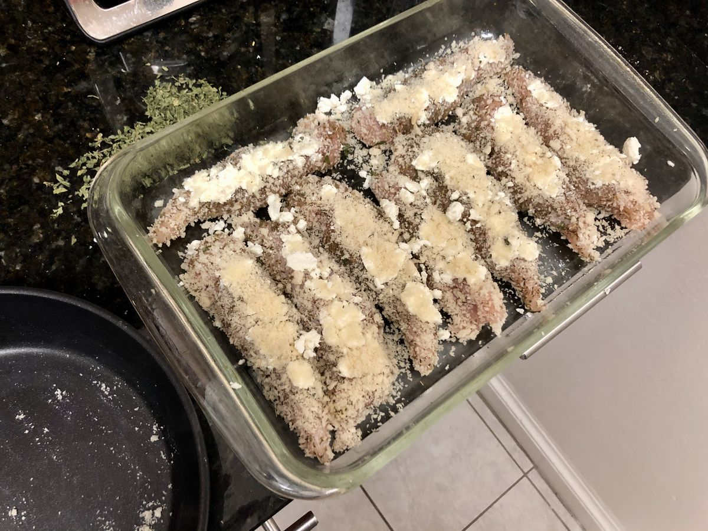

# Goat Cheese Chicken Tenders

> Based on [Kate's Goat Cheese Chicken Tenders](https://kitchenwithkate.blogspot.com/2011/10/goat-cheese-chicken-tenders.html)

<!-- rating=1; (User can specify rating on scale of 1-5) -->
<!-- AUTO-UserRating -->
Personal rating: :fontawesome-solid-star: :fontawesome-solid-star: :fontawesome-solid-star: :fontawesome-solid-star: :fontawesome-regular-star: :fontawesome-regular-star: :fontawesome-regular-star: :fontawesome-regular-star:
<!-- /AUTO-UserRating -->

<!-- name_image=goat_cheese_chicken_tenders.jpeg; (User can specify image name) -->
<!-- AUTO-Image -->
{: .image-recipe loading=lazy }
<!-- /AUTO-Image -->

## Ingredients

* [ ] 1 lb Chicken, Tenderloin cut
* [ ] Bread Crumbs
* [ ] 2-4 oz Goat Cheese
* [ ] 1 tsp Thyme
* [ ] 1 tsp Rosemary
* [ ] 1 tsp Basil
* [ ] 1 tsp Oregano
* [ ] 1/2 tsp Parsley

## Recipe

* Pre-heat oven to 400
* Spray a casserole dish
* Combine the spices and toss on both sides of the chicken
* Crumble and press the goat cheese on one side of the chicken
* In a pan/bowl, cover with bread crumbs
* Bake for 15-25 min depending on thickness (at 350, baked for 25 min)
* Broil if possible

## Notes

* Useful to use-up leftover goat cheese. Otherwise not great
* Herbs are a best guess of Herbs de Provence
* Maybe egg yolk could help create a better bread crust?
