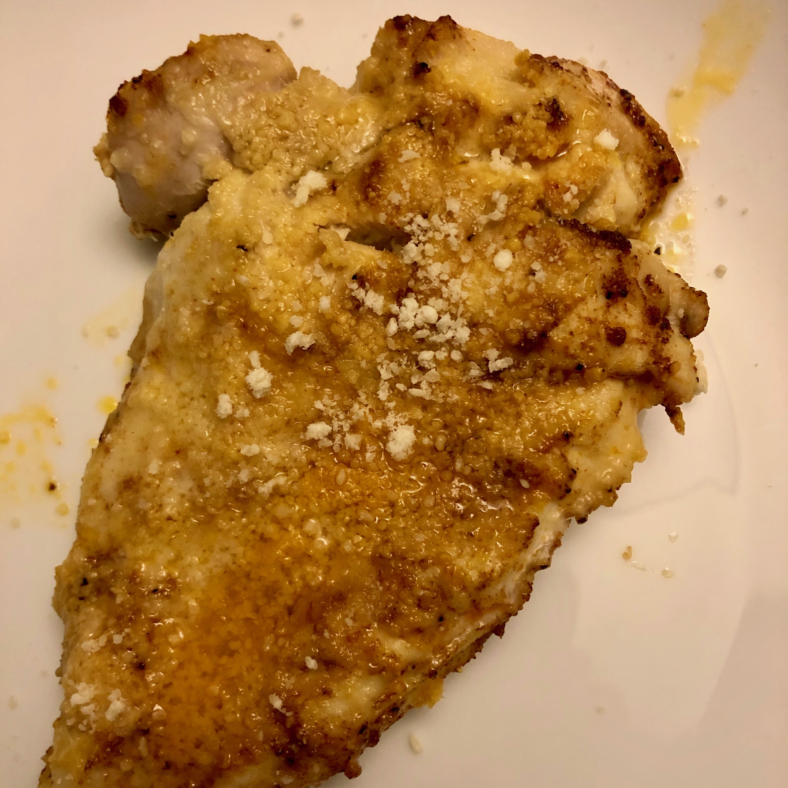

<!-- Do not modify. Auto-generated with mkdocs_migrate.py -->

# Paremesan Chicken Breasts

<!-- rating=2; (User can specify rating on scale of 1-5) -->
<!-- AUTO-UserRating -->
Personal rating: :fontawesome-solid-star: :fontawesome-solid-star: :fontawesome-regular-star: :fontawesome-regular-star: :fontawesome-regular-star:
<!-- /AUTO-UserRating -->

<!-- AUTO-Image -->
{: .image-recipe loading=lazy }
<!-- /AUTO-Image -->

## Ingredients

* [ ] sauce
    * [ ] 1/4 cup olive oil
    * [ ] 6 cloves garlic, minced
    * [ ] 1.5 tsp paprika
    * [ ] 1 tsp kosher salt
    * [ ] 1/2 tsp ground black pepper
    * [ ] 1/4 tsp cayenne pepper
* [ ] other
    * [ ] 4 chicken breasts
    * [ ] 1.5 cups Parmesan, finely grated
    * [ ] extra paprika for sprinkling

## Recipe

* Preheat oven to 400F
* In a small bowl, combine the sauce ingredients and coat the chicken. Sprinkle with Parmesan
* Bake on a foil-lined sheet for 15 minutes, then broil for 3-4 minutes to brown and sizzle the cheese. Let rest for 5 minutes
* sprinkle with a little extra paprika

## Notes

* Chrissy Teigen Cravings Hungry for More, 202
