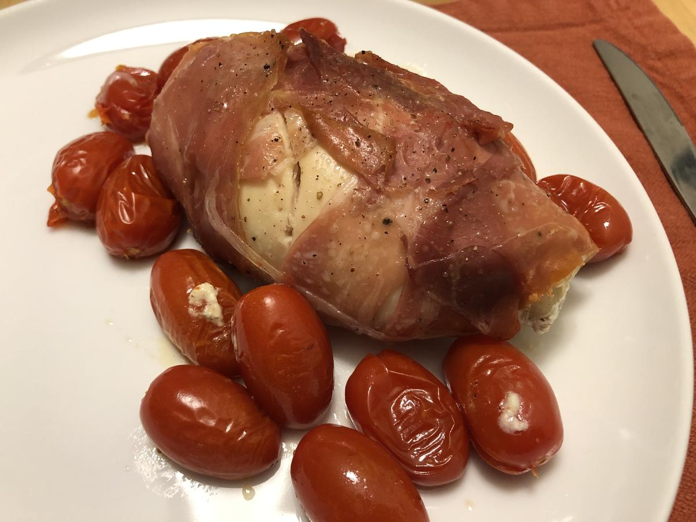

# Proscuitto-Wrapped Stuffed Chicken

> Based on [Chrissy Teigen Cravings], pg. 232

  [Chrissy Teigen Cravings]: https://www.penguinrandomhouse.com/books/252973/cravings-by-chrissy-teigen-with-adeena-sussman/

<!-- rating=5; (User can specify rating on scale of 1-5) -->
<!-- AUTO-UserRating -->
Personal rating: :fontawesome-solid-star: :fontawesome-solid-star: :fontawesome-solid-star: :fontawesome-solid-star: :fontawesome-solid-star: :fontawesome-solid-star: :fontawesome-solid-star: :fontawesome-solid-star:
<!-- /AUTO-UserRating -->

<!-- name_image=proscuitto_wrapped_stuffed_chicken.jpeg; (User can specify image name) -->
<!-- AUTO-Image -->
{: .image-recipe loading=lazy }
<!-- /AUTO-Image -->

## Ingredients

### Garlic Herb Cheese

* [ ] 2 oz cream cheese
* [ ] 2 oz fresh goat cheese
* [ ] 1.5 cloves garlic
* [ ] 1/2 tbsp fresh thyme, finely chopped
* [ ] 1/2 tbsp fresh oregano, finely chopped
* [ ] salt and pepper

### Wrapped Chicken

* [ ] 2 slices of bacon
* [ ] 2 chicken breasts (1/2 lb each), boneless and skinless, flattened
* [ ] salt and pepper
* [ ] 6 slices proscuitto (2 oz)
* [ ] 2 tbsp olive oil
* [ ] q cup cherry tomatoes
* [ ] fresh thyme and oregano sprigs (if you have them)

## Recipe

### Make the Garlic Herb Cheese

* In a bowl, combine the cream cheese, goat cheese, garlic, thyme, and oregano
* Season to taste with salt and pepper

### Chicken Prep

* Preheat the oven to 350F
* In a cast iron skillet, cook the bacon over medium heat until crisp (~8 min)
* Cool the bacon on a paper towel. Remove excess fat from the skillet
* Pound chicken and season with salt and pepper
    * Spread each piece with the herb cheese
    * Crumble bacon over the cheese and roll, starting on the short side
    * Wrap each with 3 slices of proscuitto. Make sure to entire enclose
    * Brush with olive oil and season lightly with pepper
* Place seam side down in the skillet
* Scatter tomatoes around the chicken then bake until the chicken is cooked (~30 min)

## Notes

!!! tip
    Try to get two equally sized chicken breasts. Flatten by pounding with a rolling pin until ~1/2 in thickness. Can wrap in plastic wrap if needed
