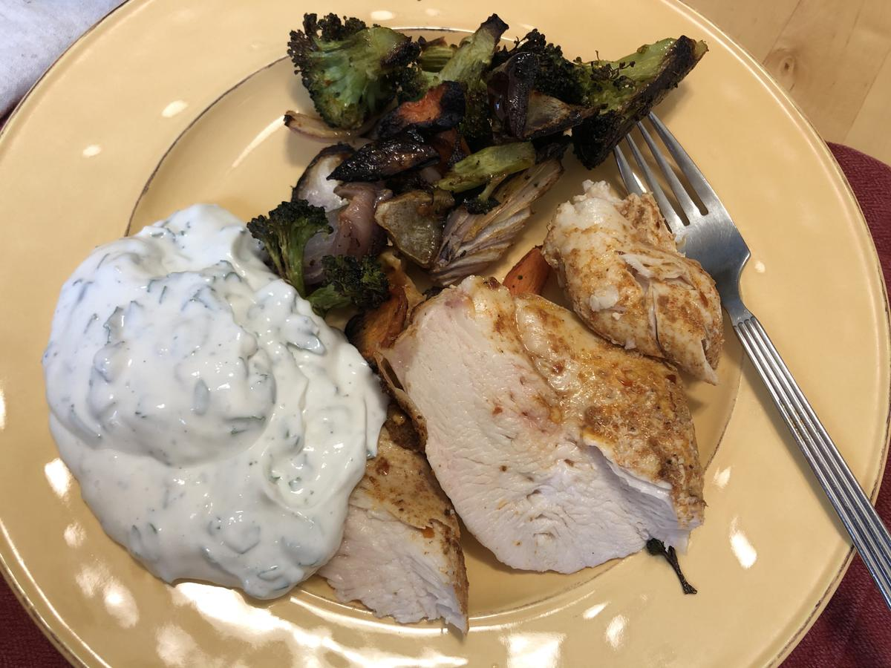

<!-- Do not modify sections with "AUTO-*". They are updated by make.py -->

# Roasted Chicken Thighs With Cauliflower and Herby Yogurt

> Based on [https://cooking.nytimes.com/recipes/1021945-roasted-chicken-thighs-with-cauliflower-and-herby-yogurt](https://cooking.nytimes.com/recipes/1021945-roasted-chicken-thighs-with-cauliflower-and-herby-yogurt)

<!-- rating=3; (User can specify rating on scale of 1-5) -->
<!-- AUTO-UserRating -->
Personal rating: :fontawesome-solid-star: :fontawesome-solid-star: :fontawesome-solid-star: :fontawesome-solid-star: :fontawesome-solid-star: :fontawesome-solid-star: :fontawesome-regular-star: :fontawesome-regular-star:
<!-- /AUTO-UserRating -->

<!-- name_image=roasted_chicken_thighs_with_cauliflower_and_herby_yogurt.jpg; (User can specify image name) -->
<!-- AUTO-Image -->
{: .image-recipe loading=lazy }
<!-- /AUTO-Image -->

## Ingredients

* [ ] 1 tsp ground coriander
* [ ] 1 tsp smoked paprika
* [ ] 11/2 tsp red-pepper flakes
* [ ] 3 tbsp olive oil, divided
* [ ] salt and pepper
* [ ] 6 bone-in, skin-on chicken thighs (~3 lbs)
* [ ] 1 small head cauliflower, cut into 2" florets (~1.5 lbs/~5 cups)
* [ ] 3 shallots, quartered lengthwise (1 heaping cup)
* [ ] 1.25 cups Greek yogurt
* [ ] 2 tbsp chopped fresh mint
* [ ] 2 tbsp chopped fresh cilantro, plus more for garnish
* [ ] 2 tbsp lemon juice, plus more for serving
* [ ] 1 garlic clove, finely grated

## Recipe

* Heat oven to 425 and set a rack in the center
* In a large bowl, whisk together the coriander, paprika, and pepper flakes with 1 tbsp oil and a big pinch of salt and pepper
    * Add the chicken to the bowl and toss to coat in the oil and spices. Arrange the chicken, skin-side up, on a large baking sheet
    * Add the cauliflower, shallots, remaining 2 tbsp oil, and a sprinkle of salt and pepper to the bowl. Toss to coat, then arrange the vegetables in a single layer surrounding the chicken
* Bake until the chicken is deep golden brown and cooked through and the cauliflower is browned, tossing the vegetables once or twice, about 40 minutes. (If the chicken is done before the cauliflower, transfer the thighs to a plate, cover, and continue cooking the cauliflower until golden brown)
* *While the chicken bakes*, prepare the yogurt sauce: Whisk the yogurt, mint, cilantro, lemon juice, and grated garlic with a pinch of salt and a few grinds of pepper. Cover and refrigerate until serving.
* Transfer the chicken and vegetables to a platter and top with any juices left on the sheet pan and a squeeze of lemon juice. Serve with a swoop of yogurt on the side, and fresh cilantro
