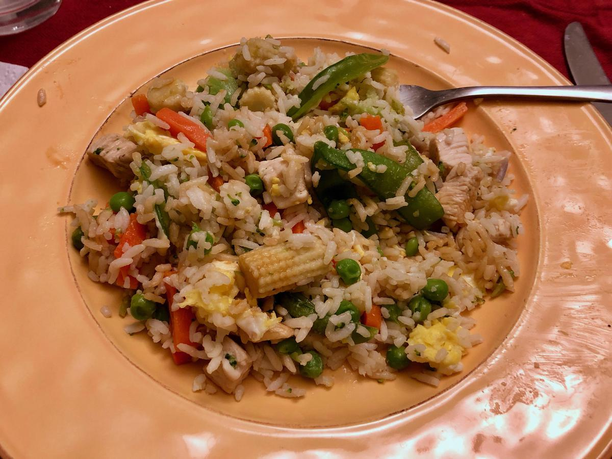

<!-- Needs Manual Review -->

# Fried Rice

<!-- {cts} rating=3; (User can specify rating on scale of 1-5) -->
Personal rating: :fontawesome-solid-star: :fontawesome-solid-star: :fontawesome-solid-star: :fontawesome-solid-star: :fontawesome-solid-star: :fontawesome-solid-star: :fontawesome-regular-star: :fontawesome-regular-star:
<!-- {cte} -->

<!-- {cts} name_image=fried_rice.jpeg; (User can specify image name) -->
{: .image-recipe loading=lazy }
<!-- {cte} -->

## Ingredients

* [ ] Combine
    * [ ] 2 cups day-old rice
    * [ ] 1 chicken breast chopped (or shrimp, etc)
    * [ ] 1-2 bag(s) frozen oriental vegetables
    * [ ] 1/2 bag frozen peas
    * [ ] finely chopped onion, carrots, broccoli
    * [ ] 3 eggs
    * [ ] 1 tbsp soy sauce
    * [ ] 1 tbsp Sriracha
    * [ ] 1 tsp sesame oil
    * [ ] garlic
    * [ ] kosher salt
    * [ ] optional: 4 green onions, chopped
    * [ ] optional: bean sprouts

## Recipe

* Prep the rice at least 1 day before and store in the fridge
* On medium-high heat with a small amount of oil, cook the chicken first, then start adding the vegetables. Add in the seasonings and cook until everything is defrosted and cooked
* Lower to medium heat, add the rice and soy sauce
* In a separate pan (or in the middle of a wok), use sesame oil and scramble the eggs into small chunks
* Mix in the eggs, and optional toppings (green onion, beans sprouts, etc)

## Notes

* Based on: http://www.geniuskitchen.com/recipe/chinese-fried-rice-38748
