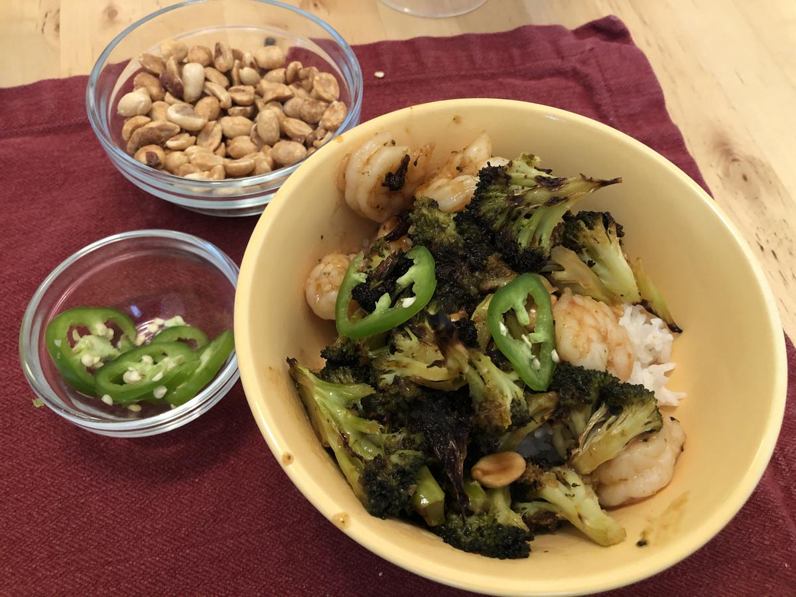

<!-- Do not modify sections with "AUTO-*". They are updated by make.py -->

# Kung Pao Roasted Broccoli

> Based on [Chrissy Teigen Cravings Hungry for More], pg. 141

  [Chrissy Teigen Cravings Hungry for More]: https://www.penguinrandomhouse.com/books/553580/cravings-hungry-for-more-by-chrissy-teigen-with-adeena-sussman/

<!-- rating=5; (User can specify rating on scale of 1-5) -->
<!-- AUTO-UserRating -->
Personal rating: :fontawesome-solid-star: :fontawesome-solid-star: :fontawesome-solid-star: :fontawesome-solid-star: :fontawesome-solid-star: :fontawesome-solid-star: :fontawesome-solid-star: :fontawesome-solid-star:
<!-- /AUTO-UserRating -->

<!-- name_image=kung_pao_roasted_broccoli.jpeg; (User can specify image name) -->
<!-- AUTO-Image -->
{: .image-recipe loading=lazy }
<!-- /AUTO-Image -->

## Ingredients

### Broccoli

* [ ] 1/4 cup vegetable oil
* [ ] 1 tbsp sesame oil
* [ ] 1/4 tsp cayenne pepper
* [ ] 2 lbs broccoli (2 smaller heads)
* [ ] salt and pepper

### Kung Pao Sauce

* [ ] 1/4 cup Thai sweet chili sauce
* [ ] 2 tbsp oyster sauce
* [ ] 2 tbsp sesame oil
* [ ] 2 tbsp vegetable oil
* [ ] 1.5 tbsp Sriracha
* [ ] 1 tbsp soy sauce
* [ ] 1 tbsp unseasoned rice vinegar
* [ ] 2 cloves garlic, finely minced

### Garnish

* [ ] 1/2 cup chopped salted roasted peanuts
* [ ] 1 scallion thinly sliced
* [ ] 1 fresh jalapeno, sliced into rings

## Recipe

* Preheat the oven to 400
* Cut the broccoli into florets, stems peeled and cut into 1/4" thick rounds
* In a bowl, which together the oils and cayenne pepper. Toss the broccoli with the mixture and season with salt and pepper
* Dump the broccoli on a large rimmed baking sheet spread into a single layer. Roast until the edges are blackened and crisp (20-25 min)
* Meanwhile, whisk together the sauce in a medium bowl
* Remove the broccoli from the oven and toss with the sauce directly in the pan
* Turn on the broiler and broil the broccoli until the sauce is thick and bubbling (4-5 min)
* Transfer to a serving platter and garnish with peanuts, scallions, and jalapeno. Optionally, serve over rice
